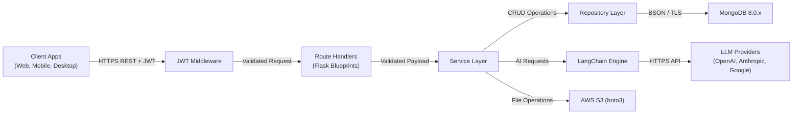

# Flask Backend API Server


A production-ready Python 3 / Flask backend API server implementing Auth0 authentication, MongoDB persistence, LangChain AI orchestration with multi-provider fallback, and AWS S3 file operations. Designed to serve six client platform types (React Web, React Native Mobile, Electron Desktop, iOS/Swift, Android/Kotlin, macOS/Objective-C) via a unified REST API.

---

## Table of Contents

- [Architecture Overview](#architecture-overview)
- [Tech Stack](#tech-stack)
- [Prerequisites](#prerequisites)
- [Getting Started](#getting-started)
- [Docker Development Workflow](#docker-development-workflow)
- [Running Tests](#running-tests)
- [API Endpoint Reference](#api-endpoint-reference)
- [Environment Variables Reference](#environment-variables-reference)
- [Deployment Guide](#deployment-guide)
- [Project Structure](#project-structure)
- [Contributing Guidelines](#contributing-guidelines)

---

## Architecture Overview

The backend enforces a **strict layered architecture** with unidirectional data flow. Every API request passes through the layers in sequence — no layer may be bypassed.



### Layered Architecture Flow

```
JWT Verification Middleware → Route Handlers → Service Layer → Repository Layer → MongoDB
                                                    ↕
                                              LangChain Engine → LLM Providers
                                                    ↕
                                              AWS S3 (boto3)
```

**Key architectural principles:**

- **JWT Verification Middleware** — Enforces a 6-step validation pipeline on every protected request: token presence → RS256 signature via JWKS → issuer → audience → expiration → RBAC permissions.
- **Route Handlers** — Flask Blueprints organized by domain concern (health, auth, documents, ai, files). Each Blueprint validates incoming request payloads using Pydantic before delegating to the Service Layer.
- **Service Layer** — Encapsulates all business logic, orchestrates between the Repository Layer and external integrations (LangChain, S3), and manages transaction boundaries.
- **Repository Layer** — Sole pathway to MongoDB. All database operations go through repository classes using PyMongo — no direct database calls are permitted elsewhere.
- **LangChain Engine** — Operates as a parallel service within the Service Layer, handling AI/LLM orchestration with a 3-tier provider fallback strategy (Primary → Secondary → Tertiary → 503).

**Application Factory Pattern:** The Flask application is created via the `create_app(config_name)` factory function, enabling modular configuration, testability with different settings, and prevention of circular imports.

---

## Tech Stack

| Component | Version | Purpose |
|---|---|---|
| **Python** | 3.14.3 | Runtime |
| **Flask** | 3.1.3 | Web framework (Application Factory + Blueprints) |
| **MongoDB** | 8.0.x | Document database |
| **PyMongo** | ~4.x | MongoDB driver (Repository Pattern) |
| **Auth0 + authlib** | ~1.x | JWT RS256 verification, OAuth 2.0 / OIDC |
| **LangChain** | ~1.2.10 | AI/LLM orchestration with multi-provider fallback |
| **LangChain-Core** | ~1.2.15 | LangChain core primitives |
| **Pydantic** | ~2.x | Request/response schema validation |
| **Gunicorn** | ~25.x | Production WSGI HTTP server |
| **flask-cors** | ~6.x | Cross-Origin Resource Sharing |
| **boto3** | ~1.42 | AWS SDK for S3 file operations |
| **python-dotenv** | ~1.x | Environment variable loading |
| **Docker** | — | Multi-stage container builds |
| **GitHub Actions** | — | CI/CD pipeline (7 stages) |
| **ruff** | ~0.15 | Linter (dev) |
| **black** | ~26.x | Code formatter (dev) |
| **pytest** | ~9.x | Test framework (dev) |

---

## Prerequisites

Before setting up the project, ensure the following are installed or available:

- **Python 3.14.3** — [Installation guide](https://www.python.org/downloads/)
- **Docker & Docker Compose** — For containerized development and deployment
- **MongoDB 8.0.17+** — Or use the included `docker-compose.yml` (recommended)
- **Auth0 account** — With an API application configured for JWT issuance
- **AWS account** — For S3 bucket access (file upload/download operations)
- **LLM provider API keys** — At least one of: OpenAI, Anthropic, or Google

---

## Getting Started

### Local Development Setup

1. **Clone the repository:**

   ```bash
   git clone <repository-url>
   cd <repository-name>
   ```

2. **Configure environment variables:**

   ```bash
   cp .env.example .env
   # Edit .env and fill in all required values (see Environment Variables Reference below)
   ```

3. **Create and activate a virtual environment:**

   ```bash
   python3.14 -m venv .venv
   source .venv/bin/activate
   ```

4. **Install dependencies:**

   ```bash
   pip install -r requirements.txt
   ```

5. **Initialize the database** (if running MongoDB locally):

   ```bash
   python scripts/init_db.py
   python scripts/seed_data.py  # Optional: load sample development data
   ```

6. **Run the Flask development server:**

   ```bash
   python run.py
   ```

   The API will be available at `http://localhost:5000`.

### Quick Start with Docker

Alternatively, start the entire stack (Flask + MongoDB replica set) with Docker:

```bash
docker-compose up --build
```

---

## Docker Development Workflow

The `docker-compose.yml` orchestrates the Flask application and a MongoDB 3-node replica set for local development.

```bash
# Start all services (Flask + MongoDB replica set)
docker-compose up --build

# Start in detached mode
docker-compose up --build -d

# View logs
docker-compose logs -f flask-app

# Stop all services
docker-compose down

# Stop and remove volumes (clean slate)
docker-compose down -v
```

| Service | URL | Description |
|---|---|---|
| Flask API | `http://localhost:5000` | Backend API server |
| MongoDB Primary | `localhost:27017` | MongoDB primary node |

- **Hot reload** is enabled via volume mount — code changes are reflected without rebuilding the container.
- The MongoDB replica set is automatically initialized for local development, matching the production topology.

---

## Running Tests

All tests use **pytest** as the test framework with fixtures defined in `tests/conftest.py`. External dependencies (Auth0, MongoDB, LLM providers, S3) are mocked in unit tests.

```bash
# Activate virtual environment
source .venv/bin/activate

# Run all tests
pytest

# Run unit tests only
pytest tests/unit/

# Run integration tests only
pytest tests/integration/

# Run with verbose output
pytest -v --tb=short

# Run with coverage report
pytest --cov=app

# Run with coverage and HTML report
pytest --cov=app --cov-report=html
```

Integration tests use the **Flask test client** to exercise the full request pipeline without requiring external services.

---

## API Endpoint Reference

All endpoints return JSON responses. Protected endpoints require a valid Auth0 JWT in the `Authorization: Bearer <token>` header.

### Health Check

| Method | Endpoint | Auth | Description |
|---|---|---|---|
| `GET` | `/api/health` | No | Liveness check — returns basic server status |
| `GET` | `/api/health/ready` | No | Readiness check — verifies MongoDB and Auth0 JWKS connectivity |

### Authentication

| Method | Endpoint | Auth | Description |
|---|---|---|---|
| `GET` | `/api/auth/profile` | Yes | Returns the decoded JWT claims for the authenticated user |
| `POST` | `/api/auth/validate` | Yes | Validates the provided token and returns validation status |

### Documents

| Method | Endpoint | Auth | Description |
|---|---|---|---|
| `GET` | `/api/documents` | Yes | List all documents (paginated) |
| `GET` | `/api/documents/<id>` | Yes | Retrieve a specific document by ID |
| `POST` | `/api/documents` | Yes | Create a new document |
| `PUT` | `/api/documents/<id>` | Yes | Update an existing document |
| `DELETE` | `/api/documents/<id>` | Yes | Delete a document |

### AI / LLM

| Method | Endpoint | Auth | Description |
|---|---|---|---|
| `POST` | `/api/ai/query` | Yes | Submit an AI query with optional context document IDs |
| `GET` | `/api/ai/results/<id>` | Yes | Retrieve the result of a previously submitted AI query |

### File Operations

| Method | Endpoint | Auth | Description |
|---|---|---|---|
| `POST` | `/api/files/upload` | Yes | Upload a file to S3 (multipart form data) |
| `GET` | `/api/files/<key>` | Yes | Generate a presigned download URL for a file |
| `DELETE` | `/api/files/<key>` | Yes | Delete a file from S3 |

### Error Response Format

All error responses follow a consistent JSON structure:

```json
{
  "error": {
    "code": 401,
    "type": "AUTHENTICATION_ERROR",
    "message": "Token expired"
  }
}
```

Error categories: Authentication (401/403), Validation (400), Database (500), LLM/AI (503), Infrastructure (500).

---

## Environment Variables Reference

Copy `.env.example` to `.env` and configure all required values. All environment-specific settings are loaded from environment variables — no secrets are hardcoded.

| Variable | Required | Default | Description |
|---|---|---|---|
| `FLASK_ENV` | Yes | `development` | Environment: `development`, `testing`, or `production` |
| `SECRET_KEY` | Yes | — | Flask secret key for session signing and CSRF protection |
| `AUTH0_DOMAIN` | Yes | — | Auth0 tenant domain (e.g., `your-tenant.auth0.com`) |
| `AUTH0_API_AUDIENCE` | Yes | — | Auth0 API audience identifier |
| `AUTH0_ALGORITHMS` | No | `RS256` | JWT signing algorithms (comma-separated) |
| `MONGODB_URI` | Yes | `mongodb://localhost:27017` | MongoDB connection string |
| `MONGODB_DATABASE` | No | `flask_backend` | MongoDB database name |
| `AWS_S3_BUCKET` | Yes | — | S3 bucket name for file storage |
| `AWS_ACCESS_KEY_ID` | Yes | — | AWS access key ID |
| `AWS_SECRET_ACCESS_KEY` | Yes | — | AWS secret access key |
| `AWS_REGION` | No | `us-east-1` | AWS region for S3 |
| `LLM_PRIMARY_PROVIDER` | Yes | — | Primary LLM provider (`openai`, `anthropic`, or `google`) |
| `LLM_PRIMARY_API_KEY` | Yes | — | API key for the primary LLM provider |
| `LLM_SECONDARY_PROVIDER` | No | — | Secondary (fallback) LLM provider |
| `LLM_SECONDARY_API_KEY` | No | — | API key for the secondary LLM provider |
| `LLM_TERTIARY_PROVIDER` | No | — | Tertiary (last-resort) LLM provider |
| `LLM_TERTIARY_API_KEY` | No | — | API key for the tertiary LLM provider |
| `LOG_LEVEL` | No | `INFO` | Logging level (`DEBUG`, `INFO`, `WARNING`, `ERROR`) |
| `CORS_ORIGINS` | No | `*` | Allowed CORS origins (comma-separated; restrict in production) |

> **Production note:** In production, sensitive credentials are loaded from **AWS Secrets Manager** instead of `.env` files.

---

## Deployment Guide

### Production Server

The application uses **Gunicorn** as the WSGI server in production (Flask's development server must never be used in production or staging):

```bash
gunicorn -c gunicorn.conf.py wsgi:app
```

Gunicorn is configured with:
- **Workers:** `2 × CPU cores + 1`
- **Bind:** `0.0.0.0:8000`
- **Timeout:** 120 seconds (accommodates AI-inclusive request latency up to 15s)
- **Graceful timeout:** 30 seconds

### Docker Build

```bash
# Build the production image (multi-stage)
docker build -t flask-backend .

# Run the container
docker run -p 8000:8000 --env-file .env flask-backend
```

The Dockerfile uses a **multi-stage build**:
1. **Builder stage** — Installs dependencies from `requirements.txt`
2. **Runtime stage** — Copies installed packages and application code, sets Gunicorn as the entrypoint

### CI/CD Pipeline

The project uses **GitHub Actions** with a 7-stage quality gate pipeline defined in `.github/workflows/ci-cd.yml`:

| Stage | Description | Gate |
|---|---|---|
| 1. **Lint** | ruff + black formatting check | Auto |
| 2. **Type Check** | Optional mypy static analysis | Auto |
| 3. **Unit Tests** | pytest with mocked dependencies | Auto |
| 4. **Security Audit** | pip audit for known vulnerabilities | Auto |
| 5. **Build** | Docker image build and push | Auto |
| 6. **Deploy Staging** | Deploy to staging environment | Auto |
| 7. **Deploy Production** | Deploy to production | Manual gate |

### Health Checks

Container orchestration platforms (ECS/Fargate) should target:
- **Liveness:** `GET /api/health` — returns `200 OK` if the server is running
- **Readiness:** `GET /api/health/ready` — returns `200 OK` if MongoDB and Auth0 JWKS are reachable

---

## Project Structure

```
/
├── README.md                          # Project documentation
├── pyproject.toml                     # PEP 621 dependency manifest
├── requirements.txt                   # pip-compatible dependency list
├── .env.example                       # Environment variable template
├── .gitignore                         # Git ignore patterns
├── ruff.toml                          # Ruff linter configuration
├── Dockerfile                         # Multi-stage container build
├── docker-compose.yml                 # Local development orchestration
├── gunicorn.conf.py                   # Gunicorn WSGI server config
├── wsgi.py                            # WSGI entry point for Gunicorn
├── run.py                             # Development server entry point
├── .github/
│   └── workflows/
│       └── ci-cd.yml                  # 7-stage CI/CD pipeline
├── app/
│   ├── __init__.py                    # Application Factory (create_app)
│   ├── config.py                      # Environment-aware configuration
│   ├── extensions.py                  # Flask extension initialization
│   ├── middleware/
│   │   ├── __init__.py
│   │   └── jwt_auth.py               # JWT verification middleware
│   ├── routes/
│   │   ├── __init__.py                # Blueprint registration
│   │   ├── health.py                  # Health check endpoints
│   │   ├── auth.py                    # Auth-related routes
│   │   ├── documents.py               # Document CRUD routes
│   │   ├── ai.py                      # AI/LLM query routes
│   │   └── files.py                   # File upload/download routes
│   ├── services/
│   │   ├── __init__.py
│   │   ├── auth_service.py            # Auth business logic
│   │   ├── document_service.py        # Document business logic
│   │   ├── ai_service.py             # AI/LLM orchestration
│   │   ├── file_service.py           # S3 file operations
│   │   └── audit_service.py          # Audit logging
│   ├── repositories/
│   │   ├── __init__.py
│   │   ├── base_repository.py        # Abstract repository with PyMongo
│   │   ├── document_repository.py    # Document data access
│   │   ├── ai_result_repository.py   # AI result persistence
│   │   └── audit_repository.py       # Audit log data access
│   ├── schemas/
│   │   ├── __init__.py
│   │   ├── auth_schemas.py           # Auth request/response models
│   │   ├── document_schemas.py       # Document validation models
│   │   ├── ai_schemas.py             # AI request/response models
│   │   ├── file_schemas.py           # File operation models
│   │   └── error_schemas.py          # Structured error models
│   ├── models/
│   │   ├── __init__.py
│   │   └── domain.py                 # Domain data models
│   ├── errors/
│   │   ├── __init__.py
│   │   └── handlers.py               # Centralized error handlers
│   └── utils/
│       ├── __init__.py
│       ├── logging.py                 # Structured logging setup
│       └── retry.py                   # Retry with backoff utilities
├── tests/
│   ├── __init__.py
│   ├── conftest.py                    # Shared fixtures, test app factory
│   ├── unit/
│   │   ├── __init__.py
│   │   ├── test_config.py
│   │   ├── test_jwt_auth.py
│   │   ├── test_document_service.py
│   │   ├── test_ai_service.py
│   │   └── test_file_service.py
│   └── integration/
│       ├── __init__.py
│       ├── test_health_routes.py
│       ├── test_document_routes.py
│       └── test_ai_routes.py
└── scripts/
    ├── init_db.py                     # MongoDB initialization script
    └── seed_data.py                   # Development seed data
```

---

## Contributing Guidelines

### Code Standards

- **PEP 8 compliance** — Enforced via [ruff](https://docs.astral.sh/ruff/) (`ruff check .`)
- **Black formatting** — Line length 100, enforced via [black](https://black.readthedocs.io/) (`black --check .`)
- **Type hints** — Use Python 3.14 type hints for all function signatures
- **Docstrings** — All public functions, classes, and modules must include docstrings

### Architecture Rules

- **Repository Pattern** — All database access must go through repository classes. No direct PyMongo calls in services, routes, or middleware.
- **Layered architecture** — Respect the unidirectional flow: Route Handlers → Service Layer → Repository Layer. No layer bypass.
- **Stateless backend** — No server-side session state. Auth0 manages all session concerns.
- **Configuration-driven** — No hardcoded secrets or environment-specific values.

### Development Workflow

1. Create a feature branch from `main`
2. Implement changes following the architecture and code standards above
3. Ensure all linting passes: `ruff check .` and `black --check .`
4. Ensure all tests pass: `pytest -v`
5. Submit a pull request for review
6. All CI/CD pipeline stages must pass before merge

### Testing Requirements

- All new features must include unit tests
- Mock all external dependencies (Auth0, MongoDB, LLM providers, S3) in unit tests
- Use the Flask test client for integration tests
- Aim for meaningful coverage of business logic and error paths

---

## License

This project is licensed under the MIT License. See [LICENSE](LICENSE) for details.
