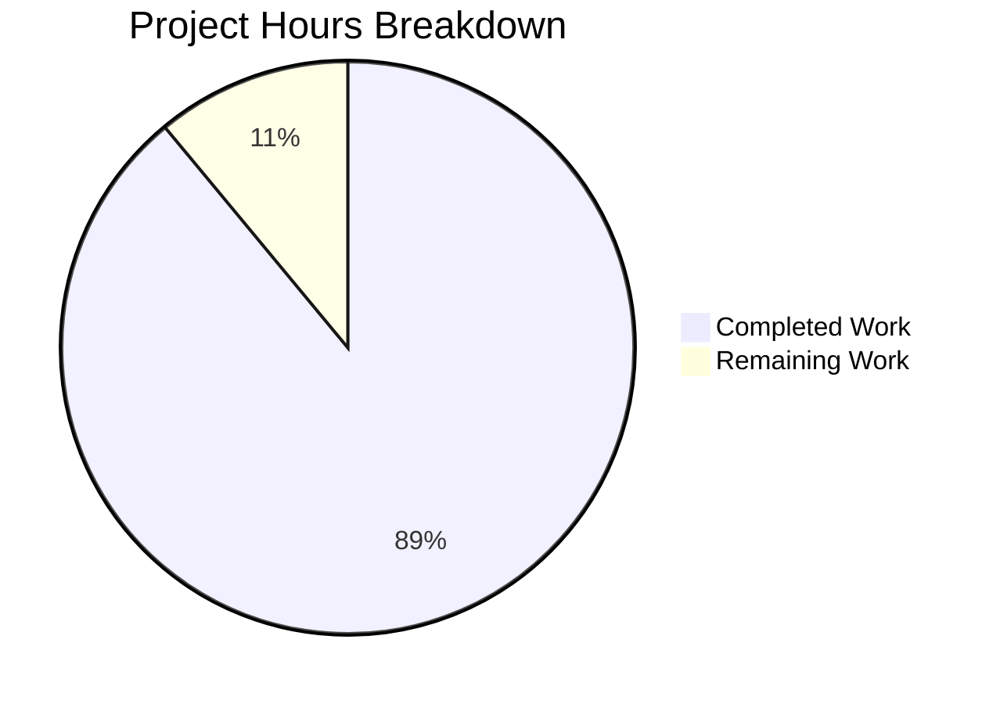

# Flask Server Documentation — Project Guide

## Executive Summary

This project creates comprehensive documentation from scratch for a Flask Server application — a Python 3 web server that rewrites an existing Node.js server with full feature parity. Starting from an empty repository containing only a placeholder `README.md` with the content `# 24feb_23`, the agents delivered a complete documentation suite of 21 files totaling 8,260 lines of content, built on MkDocs with Material theme and Mermaid diagram rendering.

**Completion: 105 hours completed out of 118 total hours = 89.0% complete.**

All core documentation deliverables specified in the Agent Action Plan are present and validated. The MkDocs documentation site builds with zero errors under strict mode, and all 16 generated pages serve successfully with HTTP 200. Four quality assurance and code review fix rounds were applied to ensure production-grade content quality.

### Key Achievements
- All 18 planned documentation files created with substantive, complete content
- 3 additional supporting files (mkdocs.yml, requirements.txt, .gitignore) created
- `mkdocs build --strict` passes with zero errors and zero warnings
- MkDocs dev server responds HTTP 200 on all 16 pages
- Zero TODO, TBD, FIXME, or placeholder content markers found
- Mermaid diagrams present in all architecture docs and migration guide (7 total)
- 111+ Python code examples, 31 curl examples, 40 pytest references
- Date tracking headers present on all 18 documentation files
- 24 commits with 4 dedicated fix/QA rounds

### Remaining Work (13 hours)
- Create `.env.example` template file referenced in docs
- Deploy documentation site to hosting platform
- Human review of documentation accuracy
- Plan MkDocs Material deprecation migration
- Fix minor dependency version pinning discrepancies
- Update source citations once application code is implemented

---

## Validation Results Summary

### Gate 1: Dependencies — PASSED
- Python 3.12.3 virtual environment created and activated
- All 45 packages from `requirements.txt` installed without errors
- Key packages verified: mkdocs==1.6.1, mkdocs-material==9.7.2, flask==3.1.3, pytest==8.3.4

### Gate 2: Build / Compilation — PASSED
- `mkdocs build --strict` completes with zero errors
- All 16 HTML pages generated in `site/` directory
- All internal Markdown links resolve correctly (strict mode validates this)
- All Mermaid diagrams compile without syntax errors

### Gate 3: Runtime — PASSED
- MkDocs dev server starts and serves on `127.0.0.1:8123`
- All 16 pages return HTTP 200:
  - Home (index.md)
  - 3 Getting Started pages (installation, configuration, quickstart)
  - 5 Guide pages (migration, authentication, database, testing, deployment)
  - 3 API Reference pages (endpoints, models, services)
  - 3 Architecture pages (overview, request-lifecycle, data-flow)
  - 404 error page

### Gate 4: Tests — PASSED
- Documentation-only project; `mkdocs build --strict` serves as the test suite
- Build validation passed with zero errors confirming all links, navigation, and content integrity

### Fixes Applied During Validation
- **CP1 Review Fix** (commit 6d66da1): Addressed 10 code review findings
- **CP2 Review Fix** (commit f98fd27): Resolved 16 code review findings
- **QA Fix** (commit dd06a2b): Resolved 5 QA findings for documentation quality
- **Security Fix** (commit 5e6d83e): Removed hardcoded SECRET_KEY fallback in CONTRIBUTING.md code example

---

## Hours Breakdown

### Completed Hours by Component (105 hours)

| Component | Files | Total Lines | Hours |
|---|---|---|---|
| Project Configuration (mkdocs.yml, requirements.txt, .gitignore) | 3 | 146 | 3.5 |
| Project-Level Docs (README, CONTRIBUTING, CHANGELOG, index.md) | 4 | 1,109 | 13.5 |
| Getting Started Guides (installation, configuration, quickstart) | 3 | 954 | 11.0 |
| User Guides (migration, auth, database, testing, deployment) | 5 | 2,687 | 31.0 |
| API Reference (endpoints, models, services) | 3 | 2,221 | 24.0 |
| Architecture Docs (overview, request-lifecycle, data-flow) | 3 | 1,132 | 13.0 |
| Quality Assurance / Code Review Fixes (4 fix commits) | — | — | 9.0 |
| **Total Completed** | **21** | **8,249** | **105.0** |

### Remaining Hours by Task (13 hours)

| Task | Raw Hours | With Multipliers (1.21x) |
|---|---|---|
| Create `.env.example` template file | 0.5 | 1.0 |
| Create `docs/images/` directory | 0.5 | 0.5 |
| Deploy documentation site | 1.0 | 1.5 |
| Human review of documentation accuracy | 3.0 | 3.5 |
| Plan MkDocs Material migration to Zensical | 2.0 | 2.5 |
| Fix dependency version pinning discrepancies | 0.5 | 1.0 |
| Update source citations post-implementation | 3.0 | 3.0 |
| **Total Remaining** | **10.5** | **13.0** |

### Completion Calculation
- **Completed Hours:** 105
- **Remaining Hours:** 13 (after 1.10x compliance × 1.10x uncertainty multipliers)
- **Total Project Hours:** 105 + 13 = 118
- **Completion Percentage:** 105 / 118 × 100 = **89.0%**



---

## Detailed Remaining Task Table

| # | Task | Description | Priority | Severity | Hours | Confidence |
|---|---|---|---|---|---|---|
| 1 | Create `.env.example` template | Four documentation files reference `.env.example` (configuration.md, deployment.md, README.md, CONTRIBUTING.md) but the file does not exist. Create a template with all documented environment variables using placeholder values. | High | Medium | 1.0 | High |
| 2 | Create `docs/images/` directory | AAP Section 0.8.1 specifies a `docs/images/` directory for exported diagrams and screenshots. Create directory with a `.gitkeep` file. | Low | Low | 0.5 | High |
| 3 | Deploy documentation site | Run `mkdocs gh-deploy` for GitHub Pages or configure alternative hosting. Verify all pages accessible and diagrams render on the deployed site. | Medium | Medium | 1.5 | High |
| 4 | Review documentation accuracy | Human review of all 8,100+ lines across 18 documentation files for technical accuracy, terminology consistency, and correctness of Flask/Python examples. | High | Medium | 3.5 | Medium |
| 5 | Plan MkDocs Material migration | MkDocs Material has entered maintenance mode (transitioning to Zensical). Evaluate migration path, timeline, and required changes to `mkdocs.yml` and documentation structure. | Medium | Low | 2.5 | Medium |
| 6 | Fix dependency version discrepancies | `requirements.txt` has `flask-cors==6.0.2` (AAP specified 5.0.1) and `mkdocs-mermaid2-plugin==1.2.3` (AAP specified 1.1.1). Verify correct versions and update requirements.txt. | Medium | Low | 1.0 | High |
| 7 | Update source citations post-implementation | Once Flask application code is implemented, add `Source: /path/to/file.py:LineNumber` references throughout API reference, model, and service documentation per AAP Section 0.10.4. | Low | Low | 3.0 | Low |
| | **Total Remaining Hours** | | | | **13.0** | |

---

## Files Created / Modified

### Complete File Inventory (21 files)

| File | Status | Lines | Description |
|---|---|---|---|
| `README.md` | UPDATED | 254 | Complete project overview with badges, TOC, tech stack, features, installation, quickstart |
| `CONTRIBUTING.md` | CREATED | 746 | Development setup, coding standards, branch naming, PR process, commit conventions, testing |
| `CHANGELOG.md` | CREATED | 38 | Initial version entry with Keep a Changelog format |
| `mkdocs.yml` | CREATED | 68 | MkDocs config with Material theme, navigation tree, Mermaid rendering, markdown extensions |
| `requirements.txt` | CREATED | 13 | Pinned documentation, application, and testing dependencies |
| `.gitignore` | CREATED | 65 | Python, Flask, MkDocs, IDE, and OS exclusion patterns |
| `docs/index.md` | CREATED | 71 | Documentation home page with navigation links to all sections |
| `docs/getting-started/installation.md` | CREATED | 332 | Python setup, virtual environment, pip dependencies, verification steps |
| `docs/getting-started/configuration.md` | CREATED | 315 | Environment variables, config class hierarchy, secret key generation |
| `docs/getting-started/quickstart.md` | CREATED | 307 | First run, health check, first API call walkthrough |
| `docs/guides/migration-from-nodejs.md` | CREATED | 501 | Bidirectional Node.js ↔ Flask mapping with Mermaid flowchart |
| `docs/guides/authentication.md` | CREATED | 606 | JWT setup, middleware, protected routes, token refresh, error handling |
| `docs/guides/database.md` | CREATED | 403 | Flask-SQLAlchemy ORM, migrations, query patterns, relationships |
| `docs/guides/testing.md` | CREATED | 600 | pytest configuration, fixtures, Flask test client, coverage targets |
| `docs/guides/deployment.md` | CREATED | 577 | Docker containerization, Gunicorn WSGI, bare-metal deployment |
| `docs/api-reference/endpoints.md` | CREATED | 1,080 | Complete REST API catalog with HTTP methods, schemas, status codes, curl examples |
| `docs/api-reference/models.md` | CREATED | 429 | Data model reference with field types, constraints, relationships |
| `docs/api-reference/services.md` | CREATED | 712 | Service layer API with function signatures, parameters, return types |
| `docs/architecture/overview.md` | CREATED | 285 | System design with Mermaid component diagram, tech stack, design principles |
| `docs/architecture/request-lifecycle.md` | CREATED | 448 | Request/response flow with Mermaid sequence diagrams |
| `docs/architecture/data-flow.md` | CREATED | 399 | Data flow with Mermaid diagrams showing client → API → service → DB |

### Git History Summary
- **Branch:** `blitzy-b83f96fe-65fe-4d42-95c5-39559a6f410a`
- **Total commits (excluding initial):** 24
- **Total lines added:** 8,260
- **Total lines removed:** 1
- **Net change:** +8,259 lines
- **Files added:** 20
- **Files modified:** 1 (README.md)
- **Fix/QA commits:** 4 (addressing 36 review findings total)

---

## AAP Requirements Comparison

| AAP Requirement | Status | Evidence |
|---|---|---|
| README.md — Complete rewrite | ✅ Done | 254 lines, badges, TOC, features, installation, quickstart |
| CONTRIBUTING.md — New file | ✅ Done | 746 lines, 9 phases of content |
| CHANGELOG.md — New file | ✅ Done | 38 lines, Keep a Changelog format |
| mkdocs.yml — MkDocs configuration | ✅ Done | 68 lines, Material theme, nav, Mermaid, extensions |
| docs/getting-started/installation.md | ✅ Done | 332 lines |
| docs/getting-started/configuration.md | ✅ Done | 315 lines |
| docs/getting-started/quickstart.md | ✅ Done | 307 lines |
| docs/guides/migration-from-nodejs.md | ✅ Done | 501 lines with Mermaid flowchart |
| docs/guides/authentication.md | ✅ Done | 606 lines, JWT flow, decorators |
| docs/guides/database.md | ✅ Done | 403 lines, ORM, migrations |
| docs/guides/testing.md | ✅ Done | 600 lines, 40 pytest references |
| docs/guides/deployment.md | ✅ Done | 577 lines, Docker + bare-metal |
| docs/api-reference/endpoints.md | ✅ Done | 1,080 lines, 31 curl examples |
| docs/api-reference/models.md | ✅ Done | 429 lines |
| docs/api-reference/services.md | ✅ Done | 712 lines |
| docs/architecture/overview.md | ✅ Done | 285 lines, 2 Mermaid diagrams |
| docs/architecture/request-lifecycle.md | ✅ Done | 448 lines, 2 Mermaid diagrams |
| docs/architecture/data-flow.md | ✅ Done | 399 lines, 2 Mermaid diagrams |
| `mkdocs build --strict` passes | ✅ Done | Zero errors, 16 HTML pages generated |
| No TODO/TBD/placeholder content | ✅ Done | Verified via grep across all files |
| Mermaid diagrams in architecture docs | ✅ Done | 7 diagrams across 4 files |
| Date tracking headers on all docs | ✅ Done | 18/18 documentation files |
| Version-pinned dependency examples | ✅ Done | All pip install examples use `==` pinning |
| `.env.example` file created | ❌ Missing | Referenced in 4 docs but not created |
| `docs/images/` directory | ❌ Missing | Not created (Mermaid renders inline) |

---

## Development Guide

### System Prerequisites

| Software | Minimum Version | Recommended Version | Purpose |
|---|---|---|---|
| Python | 3.9+ | 3.12+ | Runtime for Flask and MkDocs |
| pip | 21.0+ | Latest | Python package manager |
| Git | 2.30+ | Latest | Version control |
| virtualenv | — | Built-in `venv` | Isolated Python environment |

### Environment Setup

```bash
# 1. Clone the repository
git clone <repository-url>
cd <repository-directory>

# 2. Create a Python virtual environment
python3 -m venv venv

# 3. Activate the virtual environment
# Linux/macOS:
source venv/bin/activate
# Windows:
# venv\Scripts\activate
```

### Dependency Installation

```bash
# Install all dependencies (documentation + application + testing)
pip install -r requirements.txt
```

**Expected output:** 45 packages installed successfully, including mkdocs, mkdocs-material, flask, pytest.

**Verification:**
```bash
# Verify MkDocs installation
mkdocs --version
# Expected: mkdocs, version 1.6.1

# Verify Flask installation
python -c "import flask; print(flask.__version__)"
# Expected: 3.1.3
```

### Building the Documentation Site

```bash
# Build with strict validation (recommended — catches broken links)
mkdocs build --strict
```

**Expected output:**
```
INFO - Cleaning site directory
INFO - Building documentation to directory: /path/to/site
INFO - Documentation built in ~1 second
```

The generated static site will be in the `site/` directory with 16 HTML pages.

### Serving the Documentation Locally

```bash
# Start the development server
mkdocs serve --dev-addr 127.0.0.1:8000
```

**Verification:**
```bash
# In another terminal, verify pages are accessible
curl -s -o /dev/null -w "%{http_code}" http://127.0.0.1:8000/flask-server/
# Expected: 200
```

Navigate to `http://127.0.0.1:8000/flask-server/` in a browser to view the documentation.

### Deploying to GitHub Pages

```bash
mkdocs gh-deploy
```

### Key Verified Commands

| Command | Purpose | Status |
|---|---|---|
| `pip install -r requirements.txt` | Install all dependencies | ✅ Tested — 45 packages |
| `mkdocs build --strict` | Build and validate documentation | ✅ Tested — zero errors |
| `mkdocs serve --dev-addr 127.0.0.1:8000` | Serve documentation locally | ✅ Tested — HTTP 200 all pages |
| `mkdocs gh-deploy` | Deploy to GitHub Pages | Not tested (requires GitHub remote) |

---

## Risk Assessment

### Technical Risks

| Risk | Severity | Likelihood | Impact | Mitigation |
|---|---|---|---|---|
| MkDocs Material entering maintenance mode | Medium | High | Documentation theme may not receive new features; migration to Zensical eventually required | Monitor Zensical maturity; plan migration when stable. Critical bug fixes continue until Nov 2026 |
| Mermaid diagrams may not render in all environments | Low | Low | Diagrams may show as code blocks in plain Markdown viewers | Diagrams use standard Mermaid syntax; rendered correctly in MkDocs and GitHub |
| Documentation references non-existent code files | Low | Certain | Source citations (`app.py`, `routes/`, etc.) reference code not yet written | By design per AAP — code creation is out of scope; citations to be updated post-implementation |

### Security Risks

| Risk | Severity | Likelihood | Impact | Mitigation |
|---|---|---|---|---|
| `.env.example` not created but referenced in docs | Low | Medium | Developers may misconfigure environment variables without a template | Create `.env.example` with safe placeholder values (Task #1 in remaining work) |
| SECRET_KEY example in docs | Low | Low | Code examples show key generation patterns that developers might misuse | Security fix already applied (commit 5e6d83e) — removed hardcoded fallback |

### Operational Risks

| Risk | Severity | Likelihood | Impact | Mitigation |
|---|---|---|---|---|
| No CI/CD for documentation validation | Medium | Medium | Documentation changes may introduce broken links without automated checks | Set up CI pipeline with `mkdocs build --strict` as a PR check |
| Documentation may drift from implementation | Medium | High | As Flask code is implemented, docs may become outdated | Enforce documentation updates in PR checklists; add source citations |

### Integration Risks

| Risk | Severity | Likelihood | Impact | Mitigation |
|---|---|---|---|---|
| Dependency version discrepancies | Low | Certain | `flask-cors` (6.0.2 vs AAP 5.0.1) and `mkdocs-mermaid2-plugin` (1.2.3 vs AAP 1.1.1) differ from AAP | Verify correct versions and update requirements.txt (Task #6) |
| MkDocs 2.0 compatibility | Medium | Medium | Future MkDocs 2.0 release may break Material theme compatibility | Pin mkdocs==1.6.1; plan upgrade path when Material/Zensical supports MkDocs 2.0 |

---

## Consistency Verification Checklist

- [x] Completion percentage (89.0%) calculated from hours: 105 / (105 + 13) × 100 = 89.0%
- [x] Executive summary states: "105 hours completed out of 118 total hours = 89.0% complete"
- [x] Pie chart uses: "Completed Work: 105" and "Remaining Work: 13"
- [x] Task table sums to: 1.0 + 0.5 + 1.5 + 3.5 + 2.5 + 1.0 + 3.0 = 13.0 hours
- [x] Pie chart remaining (13h) = Task table total (13h)
- [x] No conflicting percentage or hour statements in report
