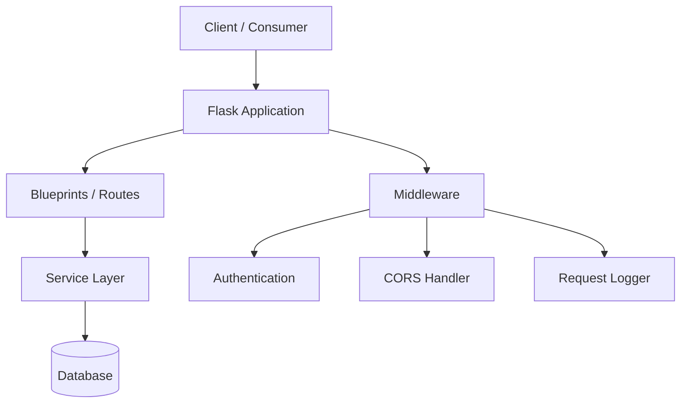
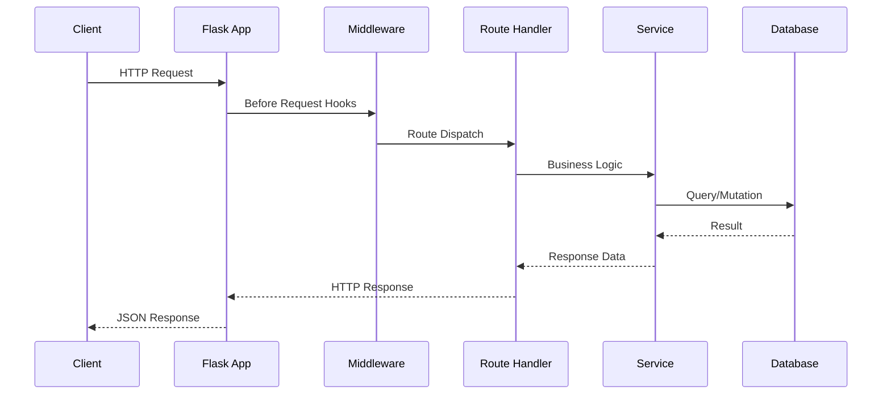

# Technical Specification

# 0. Agent Action Plan

## 0.1 Intent Clarification

### 0.1.1 Core Documentation Objective

Based on the provided requirements, the Blitzy platform understands that the documentation objective is to **create comprehensive documentation from scratch** for a project that intends to rewrite an existing Node.js server application into Python 3 using the Flask web framework, while preserving all original functionalities.

- **Request Category:** Create new documentation
- **Documentation Type:** Technical specification, API reference, migration documentation, project README, architecture documentation, and setup guides
- **Primary Goal:** Document the complete Flask-based Python 3 server application that will replace an existing Node.js server, ensuring that all original functionalities are captured, mapped, and documented for the new implementation

**Critical Observation:** The repository currently contains only a single placeholder file (`README.md`) with the content `# 24feb_23`. There is **no existing Node.js source code** in the repository to analyze or document. As a result, the documentation effort must be constructed based on the user's stated intent and general best practices for a Node.js-to-Flask migration project, without the ability to perform source code-level documentation extraction.

**Documentation Requirements with Enhanced Clarity:**
- Create a project README documenting the Flask application, its purpose, setup instructions, and usage
- Produce architecture documentation capturing the server's structure in Flask/Python 3
- Create API reference documentation for all server endpoints and interfaces
- Document the migration mapping from Node.js concepts to Flask/Python 3 equivalents
- Establish a getting-started guide covering installation, configuration, and first run
- Create a contribution guide with development environment setup and coding standards

### 0.1.2 Special Instructions and Constraints

- **Preservation Mandate:** The user explicitly requires that "all functionalities of the original project" must be preserved in the rewrite, which implies that documentation must comprehensively catalog every feature and endpoint of the target Flask application
- **Technology Constraint:** The target stack is explicitly specified as Python 3 with Flask — no alternative frameworks should be documented
- **No Existing Source Code:** Since the repository is empty, documentation must be structured as a project scaffold that will guide code generation agents during implementation
- **No User-Provided Templates:** No documentation templates, style guides, or examples were provided by the user
- **No Attachments:** Zero attachments were provided for this project
- **No Environment Variables or Secrets:** No environment configuration was specified
- **No Setup Instructions:** No custom setup instructions were provided

### 0.1.3 Technical Interpretation

These documentation requirements translate to the following technical documentation strategy:

- To **document the Flask application architecture**, we will create `docs/architecture/overview.md` describing the server's module structure, routing layer, middleware, and service organization
- To **document the API surface**, we will create `docs/api-reference/endpoints.md` providing comprehensive REST API documentation with request/response schemas
- To **document the migration approach**, we will create `docs/guides/migration-from-nodejs.md` mapping Node.js patterns (Express middleware, async/callback patterns, npm packages) to Flask equivalents (decorators, WSGI/async views, pip packages)
- To **document the project setup**, we will create `README.md` with installation, configuration, and quickstart content
- To **document deployment**, we will create `docs/guides/deployment.md` covering production deployment for the Flask server
- To **document development practices**, we will create `docs/contributing/development.md` with environment setup, testing, and coding standards

### 0.1.4 Inferred Documentation Needs

Based on the stated objective of rewriting a Node.js server to Flask and the empty repository state:

- **Project scaffold documentation:** The empty repository requires foundational project documentation including README, contribution guidelines, and license information
- **Flask application structure documentation:** A server application requires documented patterns for routing, request handling, error handling, database access, authentication, and configuration management
- **Dependency documentation:** The Flask ecosystem requires documented dependencies such as Flask extensions (Flask-CORS, Flask-SQLAlchemy, Flask-Migrate, etc.) based on what the Node.js server likely used
- **Testing documentation:** Server applications require documented testing strategies covering unit tests, integration tests, and API endpoint tests using pytest and Flask's test client
- **Configuration management documentation:** Server applications require documented environment variable handling, configuration files, and secret management
- **Error handling and logging documentation:** Production Flask servers require documented logging configuration and error handling patterns

## 0.2 Documentation Discovery and Analysis

### 0.2.1 Existing Documentation Infrastructure Assessment

A comprehensive repository inspection was conducted to assess existing documentation and code assets. The following search patterns were employed:

- Documentation files: `README*`, `docs/**`, `*.md`, `*.mdx`, `*.rst`, `wiki/**`
- Configuration files: `mkdocs.yml`, `docusaurus.config.js`, `sphinx.conf.py`, `.readthedocs.yml`
- Code files: `src/**`, `lib/**`, `app/**`, `server.*`, `index.*`, `package.json`
- Dependency manifests: `package.json`, `requirements.txt`, `pyproject.toml`, `Pipfile`

**Repository Analysis Results:**

| Search Target | Result |
|---|---|
| Root folder contents | Single file: `README.md` |
| README.md content | Placeholder heading: `# 24feb_23` |
| Documentation directories | None found |
| Documentation generators | None configured |
| Source code files | None present |
| Dependency manifests | None present |
| Node.js source code | Not present in repository |
| Flask/Python code | Not present in repository |
| Test files | None present |
| CI/CD configuration | None present |

**Finding:** Repository analysis reveals an **empty project scaffold** with zero documentation infrastructure, zero source code, and zero configuration. No documentation framework, API documentation tools, diagram tools, or hosting/deployment setup exist.

- Current documentation framework: **None** — to be established
- Documentation generator configuration: **None** — to be created
- API documentation tools in use: **None** — to be selected
- Diagram tools detected: **None** — Mermaid recommended as default
- Documentation hosting/deployment setup: **None** — to be configured

### 0.2.2 Repository Code Analysis for Documentation

Since the repository contains no source code, the code analysis was performed against the stated user intent and the tech spec context:

- **Stated objective:** Rewrite a Node.js server to Python 3 with Flask
- **Expected source patterns for a Flask server:**
  - Application entry point: `app.py` or `wsgi.py`
  - Route definitions: `routes/` or `blueprints/` directory
  - Models/data layer: `models/` directory
  - Service/business logic: `services/` directory
  - Configuration: `config.py` or `config/` directory
  - Static assets: `static/` directory
  - Templates (if any): `templates/` directory
  - Tests: `tests/` directory

- **Key directories examined:** Root directory only — repository contains solely `README.md`
- **Related documentation found:** None — the placeholder README has no documentation content

### 0.2.3 Web Search Research Conducted

Research was performed to gather current version information and best practices for the target documentation stack:

- **Flask framework version:** Flask 3.1.3 is the latest stable release (February 19, 2026). Flask supports Python 3.9 and newer. Core dependencies include Werkzeug ≥ 3.1, Jinja2, ItsDangerous ≥ 2.2, Click, and Blinker ≥ 1.9
- **Python version:** Python 3.13.12 and Python 3.14.3 are the current stable releases (February 3, 2026). The user specified "Python 3" without a specific minor version
- **MkDocs version:** MkDocs 1.6.1 is the latest stable release (August 30, 2024). MkDocs is a static site generator suitable for project documentation using Markdown
- **MkDocs Material version:** mkdocs-material 9.7.2 is the latest version (February 18, 2026). Note: Material for MkDocs has entered maintenance mode, with the team transitioning to Zensical
- **Documentation best practices for Flask projects:** Standard practice involves a README at root, a `docs/` directory with Markdown files, API documentation auto-generated from docstrings, and Mermaid diagrams for architecture visualization

## 0.3 Documentation Scope Analysis

### 0.3.1 Code-to-Documentation Mapping

Since the repository is empty and the project involves creating a Flask server from scratch (as a rewrite of a Node.js server), the documentation must be structured to cover the anticipated Flask application modules. The following mapping is based on standard Flask server architecture patterns that would be expected in a production-grade server rewrite:

**Modules requiring documentation:**

- **Module: Application Entry Point** (`app.py` / `wsgi.py`)
  - Public APIs: Flask application factory, configuration loading, extension initialization
  - Current documentation: Missing (repository empty)
  - Documentation needed: Application startup guide, configuration reference, entry point usage

- **Module: Route/Blueprint Layer** (`routes/` or `blueprints/`)
  - Endpoints: All REST API routes that will be ported from the original Node.js Express routes
  - Current documentation: Missing (repository empty)
  - Documentation needed: API reference with endpoint descriptions, request/response schemas, authentication requirements, and example payloads

- **Module: Data Models** (`models/`)
  - Public APIs: ORM model classes, data validation schemas, serialization logic
  - Current documentation: Missing (repository empty)
  - Documentation needed: Entity-relationship documentation, model field descriptions, validation rules

- **Module: Service/Business Logic** (`services/`)
  - Public APIs: Service functions implementing core business rules
  - Current documentation: Missing (repository empty)
  - Documentation needed: Service API reference, business rule documentation, integration patterns

- **Module: Middleware and Extensions** (`middleware/` or configured in `app.py`)
  - Public APIs: CORS configuration, authentication middleware, request logging, error handlers
  - Current documentation: Missing (repository empty)
  - Documentation needed: Middleware pipeline documentation, configuration options

- **Module: Configuration** (`config.py` or `config/`)
  - Options: Environment variables, database URIs, API keys, feature flags, logging levels
  - Current documentation: Missing (repository empty)
  - Documentation needed: Configuration reference table, environment variable catalog

- **Module: Tests** (`tests/`)
  - Test suites: Unit tests, integration tests, API endpoint tests
  - Current documentation: Missing (repository empty)
  - Documentation needed: Testing guide, test execution instructions, coverage expectations

**Configuration options requiring documentation:**

| Config Category | Expected Options | Documented |
|---|---|---|
| Database | Connection URI, pool size, timeout | No — to be created |
| Server | Host, port, debug mode, workers | No — to be created |
| Authentication | Secret key, token expiry, algorithm | No — to be created |
| Logging | Log level, format, output destination | No — to be created |
| CORS | Allowed origins, methods, headers | No — to be created |

### 0.3.2 Documentation Gap Analysis

Given the requirements and repository analysis, documentation gaps encompass the **entire project** since no documentation or code exists:

**Undocumented public APIs:** All APIs are undocumented — the complete REST API surface of the Flask server requires documentation from scratch

**Missing user guides:**
- Installation and setup guide
- Configuration guide
- API usage guide with examples
- Authentication and authorization guide
- Database migration guide
- Deployment guide (development, staging, production)

**Missing architecture documentation:**
- System overview and component diagram
- Request/response lifecycle flow
- Database schema and relationships
- Authentication/authorization flow
- Error handling strategy
- Logging and monitoring architecture

**Missing migration documentation:**
- Node.js-to-Flask concept mapping (Express → Flask, npm → pip, callbacks → sync/async)
- Route mapping table (Express routes → Flask blueprints)
- Middleware mapping (Express middleware → Flask before/after request hooks)
- Package equivalence table (Node.js packages → Python packages)

**Outdated documentation:**
- `README.md` contains only a placeholder heading (`# 24feb_23`) — requires complete rewrite with project documentation

## 0.4 Documentation Implementation Design

### 0.4.1 Documentation Structure Planning

The following documentation hierarchy is designed for the Flask server rewrite project, organized to serve both developers performing the migration and consumers of the resulting application:

```
project-root/
├── README.md                          (Project overview, quickstart, badges)
├── CONTRIBUTING.md                    (Contribution guidelines, coding standards)
├── CHANGELOG.md                       (Version history and release notes)
├── docs/
│   ├── getting-started/
│   │   ├── installation.md            (Python, Flask, and dependency setup)
│   │   ├── configuration.md           (Environment variables, config files)
│   │   └── quickstart.md              (First run, hello world verification)
│   ├── guides/
│   │   ├── migration-from-nodejs.md   (Node.js to Flask migration mapping)
│   │   ├── authentication.md          (Auth setup, token management, flows)
│   │   ├── database.md               (ORM setup, migrations, query patterns)
│   │   ├── testing.md                (Test setup, running tests, coverage)
│   │   └── deployment.md             (Production deployment, Docker, WSGI)
│   ├── api-reference/
│   │   ├── endpoints.md              (REST API endpoint catalog)
│   │   ├── models.md                 (Data model reference)
│   │   └── services.md               (Service layer API reference)
│   ├── architecture/
│   │   ├── overview.md               (System design, component diagram)
│   │   ├── request-lifecycle.md      (Request/response flow)
│   │   └── data-flow.md             (Data flow with diagrams)
│   └── images/                       (Generated diagrams and screenshots)
└── mkdocs.yml                        (MkDocs configuration)
```

### 0.4.2 Content Generation Strategy

**Information Extraction Approach:**
- Since no source code exists yet, documentation content will be structured as comprehensive templates and architectural guides that code generation agents will reference during implementation
- Extract Flask API patterns from Flask 3.1.x official documentation for accuracy
- Create standard examples based on Flask best practices for route definitions, error handling, and configuration
- Structure API reference templates to be populated as endpoints are implemented

**Documentation Standards:**
- Markdown formatting with proper hierarchical headers (`#`, `##`, `###`)
- Mermaid diagram integration using fenced code blocks for all architectural visualizations
- Code examples using fenced code blocks with `python` syntax highlighting
- Source citations as inline references: `Source: /path/to/file.py:LineNumber` (once code is created)
- Tables for parameter descriptions, configuration options, and return values
- Consistent terminology: "endpoint" for REST routes, "blueprint" for Flask route groups, "model" for ORM entities, "service" for business logic modules

### 0.4.3 Diagram and Visual Strategy

**Mermaid diagrams to create:**

- **Architecture Overview** — High-level component diagram showing Flask application layers:



- **Request Lifecycle** — Sequence diagram showing a typical API request flow:



- **Migration Mapping** — Flowchart illustrating Node.js-to-Flask conceptual translation for the migration guide
- **Database Entity-Relationship** — ER diagram for documenting the data model layer (to be populated once models are defined)

## 0.5 Documentation File Transformation Mapping

### 0.5.1 File-by-File Documentation Plan

Every documentation file that must be created, updated, or deleted is exhaustively mapped below. Since the repository currently contains only a placeholder `README.md`, the majority of operations are CREATE transformations.

| Target Documentation File | Transformation | Source Code/Docs | Content/Changes |
|---|---|---|---|
| README.md | UPDATE | README.md | Complete rewrite: replace placeholder `# 24feb_23` with full project overview including description, features, installation, quickstart, API overview, project structure, and contributing links |
| CONTRIBUTING.md | CREATE | — | New file: development environment setup, coding standards, branch naming, PR process, commit message conventions, and testing requirements |
| CHANGELOG.md | CREATE | — | New file: initial version entry documenting the Flask rewrite from Node.js with feature parity notes |
| mkdocs.yml | CREATE | — | New file: MkDocs configuration with site metadata, navigation structure, theme settings (Material), Mermaid plugin, and search configuration |
| docs/getting-started/installation.md | CREATE | requirements.txt (when created) | New file: Python 3 installation, virtual environment setup, pip dependency installation, Flask verification |
| docs/getting-started/configuration.md | CREATE | config.py (when created) | New file: environment variable catalog, configuration file format, default values, and required vs optional settings |
| docs/getting-started/quickstart.md | CREATE | app.py (when created) | New file: step-by-step first run guide, server startup, health check verification, and first API call |
| docs/guides/migration-from-nodejs.md | CREATE | — | New file: comprehensive Node.js to Flask migration mapping covering Express routes to Flask blueprints, npm packages to pip equivalents, callback/promise patterns to Python sync/async, and middleware mapping |
| docs/guides/authentication.md | CREATE | services/auth (when created) | New file: authentication setup, JWT/session flow, token refresh handling, and error scenarios |
| docs/guides/database.md | CREATE | models/ (when created) | New file: database setup, ORM configuration, migration workflow, query patterns, and connection pooling |
| docs/guides/testing.md | CREATE | tests/ (when created) | New file: test environment setup, pytest configuration, fixture patterns, Flask test client usage, and coverage targets |
| docs/guides/deployment.md | CREATE | Dockerfile (when created) | New file: production deployment with Gunicorn/uWSGI, Docker containerization, reverse proxy setup, and health monitoring |
| docs/api-reference/endpoints.md | CREATE | routes/ (when created) | New file: complete REST API catalog with HTTP methods, URL patterns, request parameters, request bodies, response schemas, status codes, and curl examples |
| docs/api-reference/models.md | CREATE | models/ (when created) | New file: data model reference with field types, constraints, relationships, and serialization formats |
| docs/api-reference/services.md | CREATE | services/ (when created) | New file: service layer API reference with function signatures, parameters, return types, exceptions, and usage examples |
| docs/architecture/overview.md | CREATE | — | New file: system architecture overview with Mermaid component diagram, technology stack description, design principles, and module responsibilities |
| docs/architecture/request-lifecycle.md | CREATE | — | New file: request/response lifecycle documentation with Mermaid sequence diagram covering middleware chain, route dispatch, service invocation, and response formatting |
| docs/architecture/data-flow.md | CREATE | — | New file: data flow documentation with Mermaid diagrams showing how data moves between client, API layer, service layer, and database |

### 0.5.2 New Documentation Files Detail

**File: README.md (UPDATE)**
- Type: Project overview and quickstart
- Source Code: Entire project root
- Sections:
  - Project title, description, and purpose
  - Technology stack (Python 3, Flask 3.1.x)
  - Features list (all preserved from Node.js original)
  - Prerequisites and installation instructions
  - Quickstart guide with server startup command
  - Project directory structure overview
  - API overview with key endpoint summary
  - Links to full documentation, contributing guide, and license
- Diagrams: None (text-focused)
- Key Citations: `requirements.txt`, `app.py`, `config.py`

**File: docs/guides/migration-from-nodejs.md (CREATE)**
- Type: Migration guide
- Source Code: N/A (conceptual mapping document)
- Sections:
  - Overview of migration approach
  - Framework comparison table (Express.js vs Flask)
  - Route mapping (Express `app.get()` → Flask `@app.route()`)
  - Middleware mapping (Express `app.use()` → Flask `@app.before_request`)
  - Package equivalence table (node packages → pip packages)
  - Async patterns (Promises/callbacks → Python async/sync)
  - Error handling mapping (`try/catch` middleware → Flask error handlers)
  - Database access mapping (Mongoose/Sequelize → SQLAlchemy/Flask-SQLAlchemy)
  - Testing mapping (Jest/Mocha → pytest/Flask test client)
- Diagrams: Migration flowchart (Mermaid)
- Key Citations: Flask official documentation, Express.js documentation

**File: docs/api-reference/endpoints.md (CREATE)**
- Type: API reference
- Source Code: `routes/` or `blueprints/` directory (when created)
- Sections per endpoint:
  - HTTP method and URL path
  - Description of functionality
  - Request parameters (path, query, header)
  - Request body schema (JSON)
  - Response body schema (JSON)
  - Status codes and error responses
  - Authentication requirements
  - Example request/response using curl
- Diagrams: None (table and code block-focused)
- Key Citations: Route handler source files

**File: docs/architecture/overview.md (CREATE)**
- Type: Architecture documentation
- Source Code: Entire project structure
- Sections:
  - System overview and purpose
  - Technology stack summary
  - Architectural design (layered architecture)
  - Component breakdown with responsibilities
  - Module dependency graph
  - Design decisions and rationale
- Diagrams: Mermaid component diagram, module dependency graph
- Key Citations: `app.py`, `config.py`, all module `__init__.py` files

### 0.5.3 Documentation Configuration Updates

| Configuration File | Action | Changes |
|---|---|---|
| mkdocs.yml | CREATE | Site name, navigation tree mapping all docs, Material theme configuration, Mermaid extension, search plugin |
| requirements.txt | UPDATE (add doc deps) | Add `mkdocs`, `mkdocs-material`, `mkdocs-mermaid2-plugin` as dev/doc dependencies |
| .gitignore | UPDATE | Add `site/` directory (MkDocs build output) to ignore patterns |

### 0.5.4 Cross-Documentation Dependencies

- **Shared terminology:** A consistent glossary of terms (e.g., "endpoint," "blueprint," "model," "service") must be defined in `docs/architecture/overview.md` and referenced across all documentation files
- **Navigation links:** All documentation files link to each other via relative Markdown links; the `mkdocs.yml` navigation tree defines the reading order
- **Table of contents:** The README serves as the entry point linking to `docs/getting-started/installation.md` for onboarding and `docs/api-reference/endpoints.md` for API consumers
- **Index updates:** `mkdocs.yml` must include every new documentation file in its `nav` section
- **Diagram references:** Architecture diagrams in `docs/architecture/` are referenced from `README.md`, `docs/guides/migration-from-nodejs.md`, and `docs/getting-started/quickstart.md`

## 0.6 Dependency Inventory

### 0.6.1 Documentation Dependencies

The following documentation tools and packages are required to build, serve, and maintain the project documentation. Versions have been verified against current stable releases as of February 2026.

| Registry | Package Name | Version | Purpose |
|---|---|---|---|
| pip | mkdocs | 1.6.1 | Static site generator for project documentation; builds Markdown into HTML |
| pip | mkdocs-material | 9.7.2 | Material Design theme for MkDocs; provides responsive layout, search, navigation |
| pip | mkdocs-mermaid2-plugin | 1.1.1 | Renders Mermaid diagrams embedded in Markdown documentation |
| pip | flask | 3.1.3 | Target web framework; required to validate code examples in documentation |
| pip | pytest | 8.3.4 | Test framework; referenced in testing documentation for example commands |

**Version Verification Notes:**
- `mkdocs 1.6.1` — Latest release on PyPI as of August 30, 2024; stable and widely adopted
- `mkdocs-material 9.7.2` — Latest release as of February 18, 2026; now in maintenance mode with critical bug fixes continuing until November 2026
- `mkdocs-mermaid2-plugin 1.1.1` — Stable plugin for Mermaid diagram rendering within MkDocs
- `flask 3.1.3` — Latest stable release as of February 19, 2026; supports Python 3.9+; required as the application framework being documented
- `pytest 8.3.4` — Referenced in testing guides; standard Python test runner

### 0.6.2 Application Dependencies (Referenced in Documentation)

The following are application dependencies that will be documented in the project's dependency manifest and referenced throughout the documentation. These are the expected Flask ecosystem packages for a server rewrite:

| Registry | Package Name | Estimated Version | Purpose |
|---|---|---|---|
| pip | flask | 3.1.3 | Core web application framework |
| pip | flask-cors | 5.0.1 | Cross-Origin Resource Sharing support |
| pip | flask-sqlalchemy | 3.1.1 | SQLAlchemy ORM integration for Flask |
| pip | flask-migrate | 4.0.7 | Database schema migration with Alembic |
| pip | python-dotenv | 1.0.1 | Environment variable loading from `.env` files |
| pip | gunicorn | 23.0.0 | Production WSGI HTTP server |

**Note:** Exact versions for application dependencies will be confirmed during implementation. The versions listed above are based on current stable releases and are referenced in documentation examples and guides.

### 0.6.3 Documentation Reference Updates

Since the repository is starting from scratch, there are no existing documentation links to update. However, the following link structure must be established:

- **README.md** must contain links to:
  - `docs/getting-started/installation.md` — Installation guide
  - `docs/getting-started/quickstart.md` — Quickstart guide
  - `docs/api-reference/endpoints.md` — API reference
  - `docs/architecture/overview.md` — Architecture overview
  - `CONTRIBUTING.md` — Contribution guidelines

- **Cross-documentation links** within `docs/` must use relative Markdown link syntax:
  - Example: `[Installation Guide](../getting-started/installation.md)`
  - Example: `[API Reference](../api-reference/endpoints.md)`

## 0.7 Coverage and Quality Targets

### 0.7.1 Documentation Coverage Metrics

**Current coverage analysis:**

| Coverage Area | Documented | Total Expected | Coverage |
|---|---|---|---|
| Public APIs | 0 | Unknown (pending implementation) | 0% |
| User-facing features | 0 | Unknown (pending implementation) | 0% |
| Configuration options | 0 | Unknown (pending implementation) | 0% |
| Architecture documentation | 0 | 3 documents planned | 0% |
| User guides | 0 | 5 guides planned | 0% |
| Getting started guides | 0 | 3 guides planned | 0% |
| API reference documents | 0 | 3 references planned | 0% |
| Project-level docs (README, etc.) | 0 (placeholder only) | 3 documents planned | 0% |

**Target coverage:** 100% of all planned documentation files must be created with complete content

**Coverage gaps to address:**
- **Project-level documentation:** Currently 0% — README, CONTRIBUTING, and CHANGELOG all require creation
- **Architecture documentation:** Currently 0% — system overview, request lifecycle, and data flow all require creation
- **User guides:** Currently 0% — migration guide, authentication, database, testing, and deployment all require creation
- **API reference:** Currently 0% — endpoints, models, and services all require creation
- **Getting started guides:** Currently 0% — installation, configuration, and quickstart all require creation

### 0.7.2 Documentation Quality Criteria

**Completeness requirements:**
- All planned documentation files must contain fully written content (no placeholder or TODO sections)
- All API reference documents must include descriptions, parameters, return types, and at least one code example per documented element
- All user guides must include a purpose statement, step-by-step instructions, code examples, and a troubleshooting or common issues section
- All architecture documents must include at least one Mermaid diagram and descriptive narrative

**Accuracy validation:**
- Code examples in documentation must use valid Flask 3.1.x syntax
- API endpoint examples must use correct HTTP methods, URL patterns, and JSON schemas
- Configuration option documentation must accurately reflect environment variable names and default values
- Migration mapping must correctly translate Node.js/Express concepts to Flask/Python equivalents

**Clarity standards:**
- Technical accuracy with accessible language suitable for developers familiar with either Node.js or Python
- Progressive disclosure: getting-started guides present simple concepts first, with links to advanced guides
- Consistent terminology throughout all documentation files (see glossary in architecture overview)
- Each document begins with a one-paragraph summary of its purpose and audience

**Maintainability:**
- Source citations referencing specific files and line numbers (e.g., `Source: app.py:15`) where applicable
- Clear document headers with last-updated dates
- Template-based structure ensuring consistency across similar document types (e.g., all API references follow the same format)
- MkDocs-based build system for reproducible documentation generation

### 0.7.3 Example and Diagram Requirements

| Requirement | Target | Verification Method |
|---|---|---|
| Code examples per API endpoint | Minimum 1 (curl + Python) | Manual review of `docs/api-reference/endpoints.md` |
| Mermaid diagrams in architecture docs | Minimum 1 per architecture file | MkDocs build with Mermaid plugin |
| Migration mapping entries | Cover all major categories (routing, middleware, database, auth, testing) | Manual review of `docs/guides/migration-from-nodejs.md` |
| Configuration examples | At least 1 sample `.env` file | Presence in `docs/getting-started/configuration.md` |
| Test execution examples | Minimum 3 pytest command variations | Manual review of `docs/guides/testing.md` |
| Deployment examples | At least 1 Docker and 1 bare-metal example | Manual review of `docs/guides/deployment.md` |

**Diagram types required:**
- Component diagram (architecture overview)
- Sequence diagram (request lifecycle)
- Data flow diagram (data movement)
- Migration flowchart (Node.js to Flask mapping)
- Entity-relationship diagram (data models, once defined)

## 0.8 Scope Boundaries

### 0.8.1 Exhaustively In Scope

**New documentation files (all CREATE operations):**
- `docs/getting-started/**/*.md` — Installation, configuration, and quickstart guides
- `docs/guides/**/*.md` — Migration guide, authentication, database, testing, and deployment guides
- `docs/api-reference/**/*.md` — REST API endpoint catalog, data model reference, service layer reference
- `docs/architecture/**/*.md` — System overview, request lifecycle, and data flow documentation
- `docs/images/**/*` — Generated Mermaid diagram exports and any architectural screenshots

**Documentation file updates:**
- `README.md` — Complete rewrite from placeholder to full project documentation
- `CONTRIBUTING.md` — New contribution guidelines document
- `CHANGELOG.md` — New version history document

**Documentation configuration:**
- `mkdocs.yml` — MkDocs site configuration with Material theme, navigation, and plugins
- `requirements.txt` or `requirements-docs.txt` — Documentation dependency declarations

**Documentation assets:**
- `docs/images/` — Directory for rendered diagrams and visual assets
- Inline Mermaid diagrams within architecture and guide documents

**Documentation generation:**
- MkDocs build configuration for generating static HTML documentation site
- Mermaid plugin configuration for diagram rendering

### 0.8.2 Explicitly Out of Scope

- **Source code creation or modification:** The Flask application code (`app.py`, `routes/`, `models/`, `services/`, `config.py`, `tests/`) is NOT part of this documentation task — code generation is handled by separate implementation agents
- **Node.js source code analysis:** There is no Node.js source code in the repository to analyze; the documentation covers the planned Flask rewrite based on stated intent
- **Test file creation:** Test files (`tests/**/*.py`) are not part of documentation scope; however, testing *documentation* (`docs/guides/testing.md`) is in scope
- **Deployment infrastructure:** Actual Dockerfile, CI/CD pipeline YAML, or cloud deployment configurations are out of scope; deployment *documentation* is in scope
- **Database migrations:** Actual Alembic migration scripts are out of scope; database setup and migration *documentation* is in scope
- **Third-party service integrations:** Configuring external APIs or services is out of scope; documenting integration patterns is in scope
- **Design system alignment:** No frontend UI components or design system is relevant to this server-side Flask documentation task
- **Figma design analysis:** No Figma attachments were provided; no UI documentation is applicable
- **Package publishing:** Documentation for publishing the Flask application as a pip package is out of scope unless explicitly requested
- **Performance benchmarking documentation:** Comparative performance documentation between Node.js and Flask implementations is out of scope

## 0.9 Execution Parameters

### 0.9.1 Documentation-Specific Instructions

| Parameter | Value |
|---|---|
| Documentation build command | `mkdocs build --strict` |
| Documentation preview command | `mkdocs serve --dev-addr 127.0.0.1:8000` |
| Diagram generation command | Rendered automatically by `mkdocs-mermaid2-plugin` during build |
| Documentation deployment command | `mkdocs gh-deploy` (for GitHub Pages) or `mkdocs build` and serve the `site/` directory |
| Default format | Markdown (`.md`) with Mermaid diagrams in fenced code blocks |
| Citation requirement | Every technical section must reference source files using `Source: /path/to/file.py` format once code exists |
| Style guide | Standard Markdown with Material for MkDocs conventions — ATX-style headers, fenced code blocks, admonitions for warnings and notes |
| Documentation validation | `mkdocs build --strict` validates all internal links and navigation references |

### 0.9.2 MkDocs Configuration Specification

The `mkdocs.yml` configuration file must be created with the following structure:

```yaml
site_name: Flask Server
theme:
  name: material
```

**Key configuration requirements:**
- Navigation (`nav`) must include all 18 planned documentation files organized into logical sections
- The Material theme must be configured with search functionality enabled
- The Mermaid2 plugin must be listed under `plugins` for diagram rendering
- Markdown extensions should include `tables`, `fenced_code`, `codehilite`, and `admonition`
- The `docs_dir` defaults to `docs/` and the `site_dir` defaults to `site/`

### 0.9.3 Documentation Validation Checklist

Before documentation is considered complete, the following validation steps must pass:

- `mkdocs build --strict` completes with zero warnings and zero errors
- All internal Markdown links resolve to existing files
- All Mermaid diagrams render without syntax errors
- All code examples use valid Python 3 / Flask 3.1.x syntax
- The generated site is navigable with correct page ordering and breadcrumbs
- Every planned documentation file from the transformation mapping (Section 0.5) is present and contains complete content

## 0.10 Rules for Documentation

The following rules govern all documentation creation and maintenance for this project. These are derived from the user's requirements, Flask best practices, and the project's unique context as a from-scratch creation with no existing source code.

### 0.10.1 Content Rules

- **Preserve all functionalities:** Every feature, endpoint, and capability of the original Node.js server must be accounted for in documentation, even though no source code is available for reference. Documentation must be structured to support complete feature parity once implementation begins
- **Flask-first language:** All code examples, patterns, and architectural descriptions must use Flask/Python 3 idioms exclusively. Node.js patterns are only referenced in the migration guide for comparison purposes
- **No placeholder content:** Every documentation file must contain substantive, complete content. No sections may contain "TODO," "TBD," or "Coming soon" markers
- **Code example accuracy:** All Python code examples must be syntactically valid for Python 3.9+ and Flask 3.1.x. Examples should be minimal and self-contained
- **Mermaid diagrams required:** All architecture documents and any document describing a process flow must include at least one Mermaid diagram

### 0.10.2 Structural Rules

- **Consistent file naming:** All documentation files use lowercase with hyphens as separators (e.g., `migration-from-nodejs.md`, not `MigrationFromNodeJS.md`)
- **Hierarchical headers:** Documents must use ATX-style headers (`#`, `##`, `###`) with no level skipping
- **One topic per file:** Each documentation file addresses a single cohesive topic. Cross-cutting concerns are handled through cross-references rather than duplication
- **Navigation alignment:** Every documentation file must appear in the `mkdocs.yml` navigation configuration. No orphan documents are permitted

### 0.10.3 Migration-Specific Rules

- **Bidirectional mapping:** The migration guide must map concepts in both directions (Node.js → Flask and Flask → Node.js context) so that developers coming from either ecosystem can orient themselves
- **Package equivalence:** Every Node.js package referenced in the original server's functionality must have a documented Python/Flask equivalent in the migration guide
- **Pattern translation:** Common Express.js patterns (middleware chains, route grouping, error handling) must each have a corresponding Flask pattern documented with working code examples

### 0.10.4 Maintenance Rules

- **Source citations:** Once implementation code exists, every technical claim in the documentation must include a file path citation to the source code that implements it
- **Version pinning in examples:** All dependency installation examples must reference specific version numbers (e.g., `pip install flask==3.1.3`), never unpinned `pip install flask`
- **Date tracking:** Each documentation file must include a metadata header or footer indicating when it was last updated

## 0.11 References

### 0.11.1 Repository Files and Folders Searched

The following files and folders were searched across the codebase to derive conclusions for this Agent Action Plan:

| Path | Type | Result |
|---|---|---|
| `` (root) | Folder | Contains only `README.md`; no source code, configuration, or documentation directories |
| `README.md` | File | Placeholder content: `# 24feb_23` — no project documentation present |
| `docs/` | Folder | Does not exist |
| `src/` | Folder | Does not exist |
| `lib/` | Folder | Does not exist |
| `package.json` | File | Does not exist — no Node.js project manifest found |
| `requirements.txt` | File | Does not exist — no Python dependency manifest found |
| `mkdocs.yml` | File | Does not exist — no documentation generator configuration found |
| `.blitzyignore` | File | Not found anywhere in the filesystem |
| `/tmp/environments_files/` | Folder | Does not exist — no user-provided environment files |

### 0.11.2 Tech Spec Sections Retrieved

The following sections from the Technical Specification document were retrieved and analyzed for background context:

| Section | Key Insights |
|---|---|
| 1.1 Executive Summary | Describes "Archie Job - Reverse Document Generator" — a Python 3.12 Cloud Run Job for AI-driven spec generation. Confirms this is the Blitzy platform's own tool, not the user's project |
| 1.2 System Overview | Details integration with 12 external services, 5 core components in `/app/lib/reverse_document/`, and agent-LLM mappings |
| 1.3 Scope | In-scope: 10 capabilities. Implementation boundary: Python 3.12 primary, Node.js 20 LTS for MCP tooling only. Confirms the tech spec system is not a Node.js server |
| 2.1 Feature Catalog | 13 features (F-001 through F-013) across 6 categories — all marked "Completed". Covers the Blitzy platform's spec generation pipeline |
| 2.2 Functional Requirements | Comprehensive requirements for all 13 features with acceptance criteria and technical specifications |
| 3.1 Programming Languages | Primary: Python 3.12. Node.js 20 LTS installed for MCP tooling only — not for business logic |
| 3.2 Frameworks & Libraries | Core: LangGraph, LangChain, Pydantic V2. All provided via `blitzy-platform-shared==0.0.616` |
| 3.3 Open Source Dependencies | Single dependency: `blitzy-platform-shared==0.0.616`. All others are transitive |
| 3.7 Technology Stack Summary | Complete version matrix: Python 3.12, Node.js 20 LTS, Ubuntu 24.04, Claude Opus 4.6, GPT-5 Mini |
| 5.1 High-Level Architecture | Monolithic event-driven batch-processing AI pipeline on Cloud Run Job. 7-node LangGraph StateGraph |
| 6.1 Core Services Architecture | Explicitly "NOT applicable" — monolithic pipeline, not microservices |

### 0.11.3 External Research Conducted

| Search Query | Key Finding |
|---|---|
| Flask latest stable version 2025 | Flask 3.1.3 released February 19, 2026. Supports Python 3.9+. Dependencies: Werkzeug ≥ 3.1, ItsDangerous ≥ 2.2, Blinker ≥ 1.9 |
| Python 3 latest stable version 2026 | Python 3.14.3 and 3.13.12 released February 3, 2026. Python 3.14 is the latest feature release series |
| MkDocs latest version 2025 | MkDocs 1.6.1 released August 30, 2024. mkdocs-material 9.7.2 released February 18, 2026 (now in maintenance mode) |

### 0.11.4 Attachments and External Resources

- **User attachments:** 0 attachments provided
- **Figma screens:** None provided
- **Environment files:** None provided
- **Setup instructions:** None provided
- **Environment variables:** None configured
- **Secrets:** None configured

