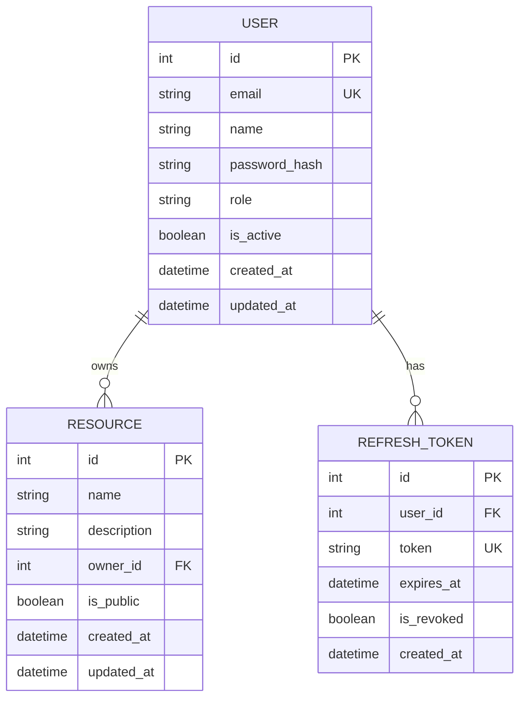

# Data Models Reference

*Last updated: 2026-02-24*

This document provides a comprehensive reference for all SQLAlchemy ORM data models in the Flask server application, documenting field types, constraints, relationships, validation rules, and serialization formats. It is intended for developers working with the application's data layer, writing database queries, or extending the data model. For standard terminology used throughout this document — including "model," "service," "endpoint," and "blueprint" — see the [Architecture Overview glossary](../architecture/overview.md#glossary).

## Models Overview

Models are SQLAlchemy ORM classes that map directly to database tables. Each model inherits from `db.Model` (provided by Flask-SQLAlchemy) and declares a `__tablename__` attribute specifying the underlying table name. Models define the database schema — including columns, data types, constraints, and indexes — as class-level attributes using `db.Column`. Every model provides a `to_dict()` serialization method that converts the ORM instance into a JSON-compatible Python dictionary for use in API responses. Models are located in the `models/` directory with one file per domain entity.

The application currently defines three domain models:

| Model | Table | Source File | Description |
|---|---|---|---|
| `User` | `users` | `models/user.py` | Application users with authentication credentials and role-based access control |
| `Resource` | `resources` | `models/resource.py` | Application-managed resources owned by users |
| `RefreshToken` | `refresh_tokens` | `models/refresh_token.py` | JWT refresh tokens issued to users for session continuity |

See [Database Guide](../guides/database.md) for Flask-SQLAlchemy setup, migration workflow, and query patterns.

See [Architecture Overview](../architecture/overview.md) for how the data access layer fits within the system architecture.

## Entity-Relationship Diagram

The following Mermaid ER diagram illustrates all models and their relationships. Primary keys (PK), foreign keys (FK), and unique keys (UK) are annotated on each field.



### Relationship Summary

- A **User** can own zero or more **Resources** (one-to-many). Each resource is linked to its owner through the `owner_id` foreign key on the `resources` table.
- A **User** can have zero or more **Refresh Tokens** (one-to-many). Each token is linked to its user through the `user_id` foreign key on the `refresh_tokens` table.
- Every **Resource** belongs to exactly one **User** (via `owner_id` → `users.id`).
- Every **Refresh Token** belongs to exactly one **User** (via `user_id` → `users.id`).

## User

`Source: models/user.py`

Represents application users with authentication credentials and role-based access control. The User model stores login credentials (email and bcrypt-hashed password), profile information (name), authorization data (role and active status), and audit timestamps. It serves as the central identity entity referenced by both the Resource and RefreshToken models.

**Table name:** `__tablename__ = "users"`

### Fields

| Field | Type | Constraints | Default | Description |
|---|---|---|---|---|
| `id` | `Integer` | Primary Key, Auto-increment | — | Unique user identifier |
| `email` | `String(255)` | Unique, Not Null, Indexed | — | User's email address; used for authentication |
| `name` | `String(255)` | Not Null | — | User's display name |
| `password_hash` | `String(255)` | Not Null | — | Bcrypt-hashed password (never stored in plain text) |
| `role` | `String(50)` | Not Null | `"user"` | User role. Values: `"user"`, `"admin"` |
| `is_active` | `Boolean` | Not Null | `True` | Whether the user account is active |
| `created_at` | `DateTime` | Not Null | `datetime.now(timezone.utc)` | Timestamp of account creation (UTC) |
| `updated_at` | `DateTime` | Not Null | `datetime.now(timezone.utc)` | Timestamp of last update (UTC); auto-updated on modification |

### Relationships

| Relationship | Target Model | Type | Back-reference | Description |
|---|---|---|---|---|
| `resources` | `Resource` | One-to-Many | `Resource.owner` | Resources owned by this user |
| `refresh_tokens` | `RefreshToken` | One-to-Many | `RefreshToken.user` | JWT refresh tokens issued to this user |

### Serialization

The `to_dict()` method converts a User instance into a JSON-compatible dictionary. The `password_hash` field is intentionally excluded from the output for security — hashed credentials are never exposed in API responses.

```python
def to_dict(self) -> dict:
    return {
        "id": self.id,
        "email": self.email,
        "name": self.name,
        "role": self.role,
        "is_active": self.is_active,
        "created_at": self.created_at.isoformat(),
        "updated_at": self.updated_at.isoformat(),
    }
```

> **Security note:** `password_hash` is intentionally excluded from serialization. Never include password hashes, tokens, or other credential material in API responses.

### Model Definition

```python
# models/user.py
from extensions import db
from datetime import datetime, timezone

class User(db.Model):
    __tablename__ = "users"

    id = db.Column(db.Integer, primary_key=True)
    email = db.Column(db.String(255), unique=True, nullable=False, index=True)
    name = db.Column(db.String(255), nullable=False)
    password_hash = db.Column(db.String(255), nullable=False)
    role = db.Column(db.String(50), default="user", nullable=False)
    is_active = db.Column(db.Boolean, default=True, nullable=False)
    created_at = db.Column(
        db.DateTime, default=lambda: datetime.now(timezone.utc), nullable=False
    )
    updated_at = db.Column(
        db.DateTime,
        default=lambda: datetime.now(timezone.utc),
        onupdate=lambda: datetime.now(timezone.utc),
        nullable=False,
    )

    resources = db.relationship("Resource", backref="owner", lazy="select")
    refresh_tokens = db.relationship("RefreshToken", backref="user", lazy="select")

    def to_dict(self):
        return {
            "id": self.id,
            "email": self.email,
            "name": self.name,
            "role": self.role,
            "is_active": self.is_active,
            "created_at": self.created_at.isoformat(),
            "updated_at": self.updated_at.isoformat(),
        }

    def __repr__(self):
        return f"<User {self.email}>"
```

### Validation Rules

| Field | Rule | Enforced By |
|---|---|---|
| `email` | Must be unique across all users | Database UNIQUE constraint + service-layer check |
| `email` | Must be a valid email format | Service-layer validation |
| `email` | Maximum 255 characters | Database `String(255)` constraint |
| `name` | Must not be empty | Database NOT NULL constraint |
| `name` | Maximum 255 characters | Database `String(255)` constraint |
| `password_hash` | Must be a bcrypt hash (not plain text) | Service-layer enforcement |
| `role` | Must be `"user"` or `"admin"` | Service-layer validation |

## Resource

`Source: models/resource.py`

Represents application-managed resources (items, posts, or entities) owned by users. Each resource is associated with exactly one user through the `owner_id` foreign key. Resources can be marked as public or private, controlling visibility in list queries. The Resource model supports the standard CRUD operations documented in the [Endpoints Reference](endpoints.md).

**Table name:** `__tablename__ = "resources"`

### Fields

| Field | Type | Constraints | Default | Description |
|---|---|---|---|---|
| `id` | `Integer` | Primary Key, Auto-increment | — | Unique resource identifier |
| `name` | `String(255)` | Not Null | — | Resource name |
| `description` | `Text` | Nullable | `None` | Detailed description of the resource |
| `owner_id` | `Integer` | Foreign Key (`users.id`), Not Null | — | ID of the user who owns this resource |
| `is_public` | `Boolean` | Not Null | `False` | Whether the resource is publicly accessible |
| `created_at` | `DateTime` | Not Null | `datetime.now(timezone.utc)` | Timestamp of creation (UTC) |
| `updated_at` | `DateTime` | Not Null | `datetime.now(timezone.utc)` | Timestamp of last update (UTC) |

### Relationships

| Relationship | Target Model | Type | Back-reference | Description |
|---|---|---|---|---|
| `owner` | `User` | Many-to-One | `User.resources` | The user who owns this resource |

### Serialization

The `to_dict()` method converts a Resource instance into a JSON-compatible dictionary. The `owner_id` foreign key is included so that API consumers can identify the owning user without requiring a joined query. The related `owner` object is not included in the default serialization to avoid circular references.

```python
def to_dict(self) -> dict:
    return {
        "id": self.id,
        "name": self.name,
        "description": self.description,
        "owner_id": self.owner_id,
        "is_public": self.is_public,
        "created_at": self.created_at.isoformat(),
        "updated_at": self.updated_at.isoformat(),
    }
```

### Model Definition

```python
# models/resource.py
from extensions import db
from datetime import datetime, timezone

class Resource(db.Model):
    __tablename__ = "resources"

    id = db.Column(db.Integer, primary_key=True)
    name = db.Column(db.String(255), nullable=False)
    description = db.Column(db.Text, nullable=True)
    owner_id = db.Column(db.Integer, db.ForeignKey("users.id"), nullable=False)
    is_public = db.Column(db.Boolean, default=False, nullable=False)
    created_at = db.Column(
        db.DateTime, default=lambda: datetime.now(timezone.utc), nullable=False
    )
    updated_at = db.Column(
        db.DateTime,
        default=lambda: datetime.now(timezone.utc),
        onupdate=lambda: datetime.now(timezone.utc),
        nullable=False,
    )

    def to_dict(self):
        return {
            "id": self.id,
            "name": self.name,
            "description": self.description,
            "owner_id": self.owner_id,
            "is_public": self.is_public,
            "created_at": self.created_at.isoformat(),
            "updated_at": self.updated_at.isoformat(),
        }

    def __repr__(self):
        return f"<Resource {self.name}>"
```

### Validation Rules

| Field | Rule | Enforced By |
|---|---|---|
| `name` | Must not be empty | Database NOT NULL constraint |
| `name` | Maximum 255 characters | Database `String(255)` constraint |
| `description` | No maximum length (Text type) | No constraint (nullable) |
| `owner_id` | Must reference a valid user | Database FOREIGN KEY constraint |
| `owner_id` | Must not be empty | Database NOT NULL constraint |
| `is_public` | Must be a boolean value | Database BOOLEAN type + Python type enforcement |

## RefreshToken

`Source: models/refresh_token.py`

Stores JWT refresh tokens issued to users, enabling token refresh without re-authentication. When a user logs in via the `/api/auth/login` endpoint, the server issues both a short-lived access token and a longer-lived refresh token. The refresh token is stored in this model so that the server can validate refresh requests, enforce expiration, and support token revocation. See the [Endpoints Reference](endpoints.md#post-apiauthrefresh) for the refresh flow.

**Table name:** `__tablename__ = "refresh_tokens"`

### Fields

| Field | Type | Constraints | Default | Description |
|---|---|---|---|---|
| `id` | `Integer` | Primary Key, Auto-increment | — | Unique token identifier |
| `user_id` | `Integer` | Foreign Key (`users.id`), Not Null | — | ID of the user this token belongs to |
| `token` | `String(500)` | Unique, Not Null | — | The encoded JWT refresh token string |
| `expires_at` | `DateTime` | Not Null | — | Token expiration timestamp (UTC) |
| `is_revoked` | `Boolean` | Not Null | `False` | Whether the token has been revoked |
| `created_at` | `DateTime` | Not Null | `datetime.now(timezone.utc)` | Timestamp of token issuance (UTC) |

### Relationships

| Relationship | Target Model | Type | Back-reference | Description |
|---|---|---|---|---|
| `user` | `User` | Many-to-One | `User.refresh_tokens` | The user this refresh token belongs to |

### Serialization

The `to_dict()` method converts a RefreshToken instance into a JSON-compatible dictionary. The full `token` string is included because refresh token records are typically accessed only by internal services, not exposed directly to external API consumers.

```python
def to_dict(self) -> dict:
    return {
        "id": self.id,
        "user_id": self.user_id,
        "token": self.token,
        "expires_at": self.expires_at.isoformat(),
        "is_revoked": self.is_revoked,
        "created_at": self.created_at.isoformat(),
    }
```

### Model Definition

```python
# models/refresh_token.py
from extensions import db
from datetime import datetime, timezone

class RefreshToken(db.Model):
    __tablename__ = "refresh_tokens"

    id = db.Column(db.Integer, primary_key=True)
    user_id = db.Column(db.Integer, db.ForeignKey("users.id"), nullable=False)
    token = db.Column(db.String(500), unique=True, nullable=False)
    expires_at = db.Column(db.DateTime, nullable=False)
    is_revoked = db.Column(db.Boolean, default=False, nullable=False)
    created_at = db.Column(
        db.DateTime, default=lambda: datetime.now(timezone.utc), nullable=False
    )

    def to_dict(self):
        return {
            "id": self.id,
            "user_id": self.user_id,
            "token": self.token,
            "expires_at": self.expires_at.isoformat(),
            "is_revoked": self.is_revoked,
            "created_at": self.created_at.isoformat(),
        }

    def __repr__(self):
        return f"<RefreshToken user_id={self.user_id} revoked={self.is_revoked}>"
```

### Validation Rules

| Field | Rule | Enforced By |
|---|---|---|
| `user_id` | Must reference a valid user | Database FOREIGN KEY constraint |
| `user_id` | Must not be empty | Database NOT NULL constraint |
| `token` | Must be unique across all tokens | Database UNIQUE constraint |
| `token` | Must not be empty | Database NOT NULL constraint |
| `token` | Maximum 500 characters | Database `String(500)` constraint |
| `expires_at` | Must be a valid future datetime at issuance | Service-layer enforcement |
| `is_revoked` | Must be a boolean value | Database BOOLEAN type + Python type enforcement |

## Common Column Types

The following table lists all SQLAlchemy column types used across the application's models, along with their Python and SQL equivalents:

| SQLAlchemy Type | Python Type | SQL Type (PostgreSQL) | Usage |
|---|---|---|---|
| `db.Integer` | `int` | `INTEGER` | Primary keys, foreign keys, counters |
| `db.String(n)` | `str` | `VARCHAR(n)` | Short text with maximum length (emails, names, roles) |
| `db.Text` | `str` | `TEXT` | Unlimited-length text (descriptions, long content) |
| `db.Boolean` | `bool` | `BOOLEAN` | True/false flags (is_active, is_public, is_revoked) |
| `db.DateTime` | `datetime` | `TIMESTAMP` | Date and time values (stored in UTC) |
| `db.Float` | `float` | `FLOAT` | Decimal numbers (not currently used; available for extensions) |
| `db.JSON` | `dict` / `list` | `JSON` | Structured JSON data (supported by PostgreSQL and SQLite 3.9+) |

> **Convention:** All `DateTime` columns store timestamps in UTC. The application uses `datetime.now(timezone.utc)` as the default callable to ensure consistent timezone handling. When serialized via `to_dict()`, datetime values are formatted as ISO 8601 strings using `.isoformat()`.

## Serialization Conventions

All models in the application follow a standard serialization pattern using the `to_dict()` instance method. This section documents the conventions that apply to every model.

### Rules

1. **Every model implements `to_dict()`** — Each model class defines a `to_dict()` method that returns a plain Python dictionary containing the model's public fields.
2. **DateTime fields use ISO 8601** — All `datetime` values are serialized to ISO 8601 format using Python's built-in `.isoformat()` method (for example, `"2026-02-24T10:30:00+00:00"`).
3. **Sensitive fields are excluded** — Password hashes (`password_hash`) and other credential material are never included in the serialization output. This exclusion is enforced at the model level, not the API layer, ensuring that sensitive data cannot accidentally leak through any code path.
4. **Foreign key IDs are included** — Scalar foreign key values (for example, `owner_id`, `user_id`) are included in the serialized output so that API consumers can identify related entities without requiring joined data.
5. **Relationship objects are excluded** — Related model instances (for example, `User.resources`, `Resource.owner`) are not included in the default `to_dict()` output. This prevents circular reference issues and keeps response payloads predictable. When related data is needed, the service layer explicitly serializes the related objects separately.
6. **`__repr__` for debugging** — Each model also implements a `__repr__()` method that returns a human-readable string representation for logging and debugging purposes.

### Example Output

The following JSON shows the output of `User.to_dict()` for a sample user record:

```json
{
    "id": 1,
    "email": "alice@example.com",
    "name": "Alice",
    "role": "user",
    "is_active": true,
    "created_at": "2026-02-24T10:30:00+00:00",
    "updated_at": "2026-02-24T10:30:00+00:00"
}
```

The following JSON shows the output of `Resource.to_dict()` for a sample resource record:

```json
{
    "id": 42,
    "name": "Project Alpha",
    "description": "A collaborative research project.",
    "owner_id": 1,
    "is_public": true,
    "created_at": "2026-02-24T11:00:00+00:00",
    "updated_at": "2026-02-24T14:22:00+00:00"
}
```

The following JSON shows the output of `RefreshToken.to_dict()` for a sample token record:

```json
{
    "id": 7,
    "user_id": 1,
    "token": "eyJhbGciOiJIUzI1NiIs...",
    "expires_at": "2026-03-24T10:30:00+00:00",
    "is_revoked": false,
    "created_at": "2026-02-24T10:30:00+00:00"
}
```

## See Also

- [Database Guide](../guides/database.md) — Flask-SQLAlchemy setup, migration workflow, and query patterns
- [Service Layer Reference](services.md) — Service functions that interact with these models
- [Endpoints Reference](endpoints.md) — REST API endpoints that expose model data
- [Architecture Overview](../architecture/overview.md) — Data access layer within the system architecture
- [Data Flow](../architecture/data-flow.md) — How data moves between models and the API layer
