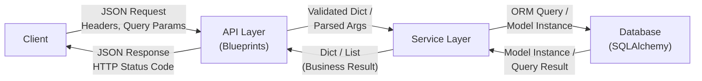
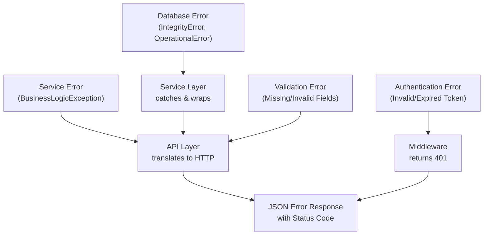

# Data Flow

*Last updated: 2026-02-24*

This document describes how data moves through the Flask server application, from client request to database and back, including validation, transformation, and error propagation at each boundary. It is intended for developers working with the Flask application's data layer, implementing new endpoints, or troubleshooting data handling issues. For standard terminology used throughout this document — including "endpoint," "blueprint," "model," and "service" — see the [Architecture Overview glossary](overview.md).

## Data Flow Overview

Data in the Flask server application travels through four distinct layers, each with a specific responsibility for transforming or enriching the data as it passes through.

1. **Client Layer** — The external consumer (browser, mobile app, or API client) that initiates HTTP requests containing JSON payloads, headers, query parameters, and path parameters. The client layer is the origin of all inbound data and the final recipient of all outbound responses.

2. **API Layer (Blueprints / Route Handlers)** — Flask blueprint modules that receive raw HTTP request data, parse it into Python objects, perform initial validation, and delegate processing to the service layer. On the return path, the API layer serializes service results into JSON responses with appropriate HTTP status codes.

3. **Service Layer** — Python modules containing business logic that transform validated input data, enforce domain rules, and orchestrate database operations. Services accept plain Python arguments and return dictionaries — they are fully decoupled from HTTP transport concerns.

4. **Database Layer** — The persistence tier accessed through SQLAlchemy ORM models via Flask-SQLAlchemy. Model instances represent rows in database tables and provide serialization methods for converting data back into dictionaries for the service layer.

Data flows in two directions through these layers:

- **Inbound (request):** Client → API Layer → Service Layer → Database
- **Outbound (response):** Database → Service Layer → API Layer → Client

Each boundary between layers involves a data transformation: JSON to Python dict, dict to ORM model instance, model instance back to dict, and dict back to JSON. The sections below detail these transformations for both directions.

## Data Flow Diagram

The following diagram illustrates the bidirectional movement of data through the four application layers, annotating the data format at each boundary crossing.



**Boundary descriptions:**

- **Client → API Layer:** The client sends an HTTP request with a JSON body, URL path parameters, query string parameters, and headers. Flask's request object exposes these as Python-native types.
- **API Layer → Service Layer:** The route handler extracts and validates the raw request data, then passes only the business-relevant fields to a service function as keyword arguments or a Python dictionary. Transport-specific information (HTTP headers, cookies, content type) is stripped at this boundary.
- **Service Layer → Database:** The service function creates or queries SQLAlchemy ORM model instances, translating Python dictionaries into model attribute assignments and issuing queries through the session.
- **Database → Service Layer:** SQLAlchemy returns model instances (or lists of instances) that encapsulate row data as Python object attributes.
- **Service Layer → API Layer:** The service function converts model instances into plain Python dictionaries using a `to_dict()` serialization method and returns them to the route handler.
- **API Layer → Client:** The route handler wraps the dictionary result in a standard JSON response envelope using `flask.jsonify()` and pairs it with an appropriate HTTP status code.

## Request Data Flow (Inbound)

### Client to API Layer

When a client sends an HTTP request to the Flask server, the data arrives in one or more of the following forms:

- **Path parameters** — Dynamic URL segments defined in the route pattern (for example, `/api/users/<int:user_id>`). Flask extracts these automatically using URL converters and passes them as arguments to the view function.
- **Query parameters** — Key-value pairs appended to the URL after `?` (for example, `?page=1&per_page=20`). Accessed in the route handler via `request.args`.
- **Request headers** — Metadata sent with the request such as `Authorization` and `Content-Type`. Accessed via `request.headers`.
- **Request body (JSON)** — The primary data payload for POST and PUT requests, sent as a JSON-encoded string in the request body. Accessed via `request.get_json()`, which parses the JSON string into a Python dictionary.

The following example shows a route handler that extracts data from all four sources:

```python
from flask import Blueprint, request, jsonify

users_bp = Blueprint("users", __name__)

@users_bp.route("/<int:user_id>", methods=["PUT"])
def update_user(user_id):
    data = request.get_json()
    if not data:
        return jsonify({"error": "Request body is required"}), 400
    result = user_service.update_user(user_id, data)
    return jsonify(result), 200
```

In this example, `user_id` is a path parameter extracted by Flask's `int` URL converter, and `data` is the parsed JSON body. If the body is missing or not valid JSON, `request.get_json()` returns `None`, and the handler returns a 400 error response.

### Request Data Validation

Before request data reaches the service layer, it passes through a validation step at the API layer. Validation ensures that incoming data meets structural and business requirements before any processing occurs.

The validation strategy covers three categories:

1. **Presence validation** — Confirm that required fields exist in the request data.
2. **Type and format validation** — Verify that values match expected data types (string, integer, email format, etc.).
3. **Business constraint validation** — Enforce application-specific rules such as maximum field lengths, allowed value sets, and referential constraints.

Validation logic can live directly in the route handler for simple cases, or in dedicated validation functions for reusability across multiple endpoints. The following example demonstrates a standalone validation function:

```python
def validate_user_data(data):
    errors = []
    if "email" not in data:
        errors.append("Email is required")
    if "name" not in data:
        errors.append("Name is required")
    if data.get("name") and len(data["name"]) > 255:
        errors.append("Name must be 255 characters or fewer")
    return errors
```

When validation fails, the API layer returns a `400 Bad Request` response containing a JSON body with the list of validation errors:

```python
# Inside a route handler function:
def create_user():
    data = request.get_json()
    errors = validate_user_data(data)
    if errors:
        return jsonify({"status": "error", "errors": errors}), 400
    # ... proceed with valid data
```

This ensures that invalid data never reaches the service layer, keeping business logic clean and focused on domain operations.

### API Layer to Service Layer

Once request data passes validation, the route handler transforms it into a format suitable for the service layer. This transformation involves extracting only the business-relevant fields from the request and passing them to service functions as Python keyword arguments or a plain dictionary.

The API layer is responsible for stripping all transport-specific concerns — HTTP headers, cookies, content type, and session data — so that service functions receive only the data they need to perform business operations. This separation ensures that services remain reusable and testable outside the HTTP context.

```python
@users_bp.route("/", methods=["POST"])
def create_user():
    data = request.get_json()
    errors = validate_user_data(data)
    if errors:
        return jsonify({"errors": errors}), 400
    user = user_service.create_user(
        email=data["email"],
        name=data["name"],
        role=data.get("role", "user"),
    )
    return jsonify(user), 201
```

In this example, the route handler explicitly maps JSON fields to named function parameters. The `role` field demonstrates a default value pattern — if the client does not provide a role, the service receives the default value `"user"`. The service function returns a dictionary representation of the created resource, which the route handler wraps in a JSON response with a `201 Created` status code.

### Service Layer to Database

Service functions interact with the database exclusively through SQLAlchemy ORM model classes. When creating or updating records, the service instantiates a model object from the validated data, adds it to the database session, and commits the transaction.

The standard ORM operation flow for creating a record is:

1. **Instantiate** the model with the validated field values.
2. **Add** the instance to the active database session via `db.session.add()`.
3. **Commit** the transaction via `db.session.commit()` to persist the data.
4. **Serialize** the persisted model instance to a dictionary using the model's `to_dict()` method and return it to the caller.

```python
from models.user import User
from extensions import db

def create_user(email, name, role="user"):
    user = User(email=email, name=name, role=role)
    db.session.add(user)
    db.session.commit()
    return user.to_dict()
```

After `db.session.commit()` executes, the model instance's auto-generated fields (such as `id` and `created_at`) are populated by the database engine. The `to_dict()` method then converts the fully populated model instance into a plain Python dictionary suitable for returning through the service layer.

## Response Data Flow (Outbound)

### Database to Service Layer

When the service layer queries the database, SQLAlchemy returns results as model instances — Python objects whose attributes correspond to database column values. A single-record query returns one model instance (or `None` if no match is found), while a multi-record query returns a list of model instances.

```python
# Single record by primary key
user = db.session.get(User, user_id)

# Single record by filter
user = User.query.filter_by(email=email).first()

# Multiple records
users = User.query.filter_by(role="admin").all()
```

For paginated queries, Flask-SQLAlchemy provides the `paginate()` method, which returns a pagination object containing both the result items and metadata:

```python
def get_all_users(page=1, per_page=20):
    pagination = User.query.paginate(page=page, per_page=per_page, error_out=False)
    return {
        "items": [user.to_dict() for user in pagination.items],
        "total": pagination.total,
        "page": pagination.page,
        "pages": pagination.pages,
    }
```

The `pagination.items` attribute contains the list of model instances for the requested page, while `pagination.total` and `pagination.pages` provide the metadata needed for constructing paginated responses.

### Service Layer to API Layer

Service functions convert ORM model instances into plain Python dictionaries before returning results to the API layer. This conversion is performed by a `to_dict()` instance method defined on each model class, implementing the serialization pattern: **model → dict → JSON**.

The `to_dict()` method explicitly maps each model column to a dictionary key, applying any necessary type conversions (such as formatting `datetime` objects as ISO 8601 strings):

```python
class User(db.Model):
    id = db.Column(db.Integer, primary_key=True)
    email = db.Column(db.String(255), unique=True, nullable=False)
    name = db.Column(db.String(255), nullable=False)
    role = db.Column(db.String(50), default="user")
    created_at = db.Column(db.DateTime, default=db.func.now())

    def to_dict(self):
        return {
            "id": self.id,
            "email": self.email,
            "name": self.name,
            "role": self.role,
            "created_at": self.created_at.isoformat(),
        }
```

This explicit serialization pattern gives full control over which fields are included in API responses. Sensitive fields such as `password_hash` are intentionally omitted from the `to_dict()` output, ensuring they are never exposed to clients.

### Response Data Formatting

The API layer receives dictionaries from the service layer and converts them into HTTP responses using `flask.jsonify()`, which serializes the dictionary to a JSON string and sets the `Content-Type` header to `application/json`.

All API responses follow a standard envelope pattern to provide a consistent interface for clients:

```json
{
    "status": "success",
    "data": {"id": 1, "email": "user@example.com", "name": "Jane Doe"},
    "message": "User created"
}
```

For list responses that include pagination metadata:

```json
{
    "status": "success",
    "data": [{"id": 1, "name": "Jane"}, {"id": 2, "name": "John"}],
    "total": 100,
    "page": 1,
    "pages": 5
}
```

For error responses:

```json
{
    "status": "error",
    "message": "Validation failed",
    "errors": ["Email is required", "Name is required"]
}
```

The HTTP status code accompanying each response communicates the outcome of the request:

| Status Code | Meaning | Usage |
|---|---|---|
| 200 | OK | Successful GET or PUT request |
| 201 | Created | Successful POST request that created a resource |
| 204 | No Content | Successful DELETE request |
| 400 | Bad Request | Validation error in request data |
| 401 | Unauthorized | Missing or invalid authentication token |
| 403 | Forbidden | Authenticated user lacks required permissions |
| 404 | Not Found | Requested resource does not exist |
| 500 | Internal Server Error | Unhandled server-side exception |

## Error Propagation

Errors can originate at any layer of the application. Each layer is responsible for catching errors from the layer below it, translating them into an appropriate representation, and propagating them upward until they reach the client as a structured JSON error response.



**Error propagation by layer:**

- **Database errors** — SQLAlchemy exceptions such as `IntegrityError` (constraint violations) and `OperationalError` (connection failures) are raised during `db.session.commit()` or query execution. The service layer catches these exceptions, rolls back the database transaction to maintain data consistency, and raises a business-level Python exception (such as `ValueError`) with a human-readable message.

- **Service errors** — Business logic exceptions raised by service functions (for example, "user with this email already exists" or "insufficient inventory") propagate up to the API layer. The route handler catches these exceptions and translates them into appropriate HTTP error responses with the correct status code (typically 409 Conflict or 422 Unprocessable Entity).

- **Validation errors** — Detected at the API layer before any service function is invoked. When validation fails, the route handler immediately returns a `400 Bad Request` response containing the list of validation errors. The service layer is never reached.

- **Authentication errors** — Detected in the `before_request` middleware during JWT token validation. If the token is missing, malformed, or expired, the middleware short-circuits the request and returns a `401 Unauthorized` response. The route handler and service layer are never reached.

- **Unhandled errors** — Any exception not caught by the layers above is caught by Flask's global error handlers registered via `@app.errorhandler()`. These handlers log the exception for debugging, roll back any open database transactions, and return a generic `500 Internal Server Error` response to prevent internal details from leaking to the client.

The following example demonstrates the complete error propagation chain from database to client:

```python
# Service layer — catches database errors and raises business exceptions
from sqlalchemy.exc import IntegrityError

def create_user(email, name, role="user"):
    try:
        user = User(email=email, name=name, role=role)
        db.session.add(user)
        db.session.commit()
        return user.to_dict()
    except IntegrityError:
        db.session.rollback()
        raise ValueError(f"User with email {email} already exists")

# Route handler — catches business exceptions and returns HTTP error responses
@users_bp.route("/", methods=["POST"])
def create_user_endpoint():
    data = request.get_json()
    try:
        user = user_service.create_user(**data)
        return jsonify(user), 201
    except ValueError as e:
        return jsonify({"error": str(e)}), 409
```

In this flow, an `IntegrityError` from a duplicate email insert is caught by the service, the transaction is rolled back, and a `ValueError` is raised. The route handler catches the `ValueError` and returns a `409 Conflict` response to the client with a descriptive error message.

## Database Transaction Patterns

Flask-SQLAlchemy manages database sessions within the Flask request context. The session is automatically scoped to each request and removed at the end of the request via `db.session.remove()`, ensuring that connections are returned to the pool and no stale session state leaks between requests.

The application uses three transaction patterns depending on the complexity of the operation:

### Auto-Commit Pattern

For simple single-operation transactions, the service function performs one database operation and commits immediately. This is the most common pattern for straightforward create, update, and delete operations.

```python
def update_user_role(user_id, new_role):
    user = User.query.get_or_404(user_id)
    user.role = new_role
    db.session.commit()
    return user.to_dict()
```

### Explicit Rollback Pattern

When an operation may fail due to constraint violations or other database errors, the service function wraps the operation in a `try/except` block and explicitly rolls back the transaction before re-raising the exception. This ensures that partial writes are never persisted.

```python
def create_user(email, name, role="user"):
    try:
        user = User(email=email, name=name, role=role)
        db.session.add(user)
        db.session.commit()
        return user.to_dict()
    except IntegrityError:
        db.session.rollback()
        raise ValueError(f"User with email {email} already exists")
```

### Multi-Operation Transaction Pattern

When a business operation requires multiple related database changes that must succeed or fail together, all changes are made within a single transaction and committed with one `db.session.commit()` call. If any step fails, the entire set of changes is rolled back.

```python
def transfer_ownership(item_id, from_user_id, to_user_id):
    item = Item.query.get_or_404(item_id)
    if item.owner_id != from_user_id:
        raise ValueError("User does not own this item")

    item.owner_id = to_user_id
    log = TransferLog(
        item_id=item_id,
        from_user_id=from_user_id,
        to_user_id=to_user_id,
    )
    db.session.add(log)
    db.session.commit()
    return item.to_dict()
```

In this example, both the ownership change on the `Item` model and the creation of a `TransferLog` record are committed atomically. If either operation fails, `db.session.rollback()` (triggered by the exception handler or Flask's teardown) reverses both changes, preserving data integrity.

## See Also

- [Architecture Overview](overview.md) — System component descriptions, technology stack, and terminology glossary
- [Request Lifecycle](request-lifecycle.md) — Full request processing sequence from client initiation to JSON response delivery
- [Database Guide](../guides/database.md) — Database setup, ORM configuration, migration workflow, and query patterns
- [API Reference](../api-reference/endpoints.md) — Complete REST API endpoint catalog with request and response schemas
- [Models Reference](../api-reference/models.md) — Data model definitions with field types, constraints, and relationships
