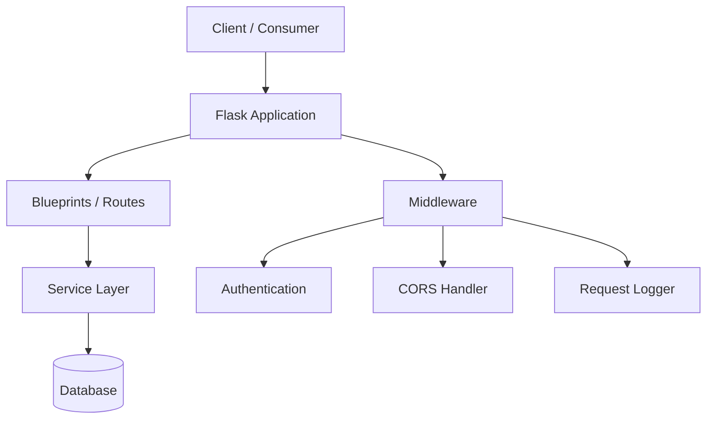
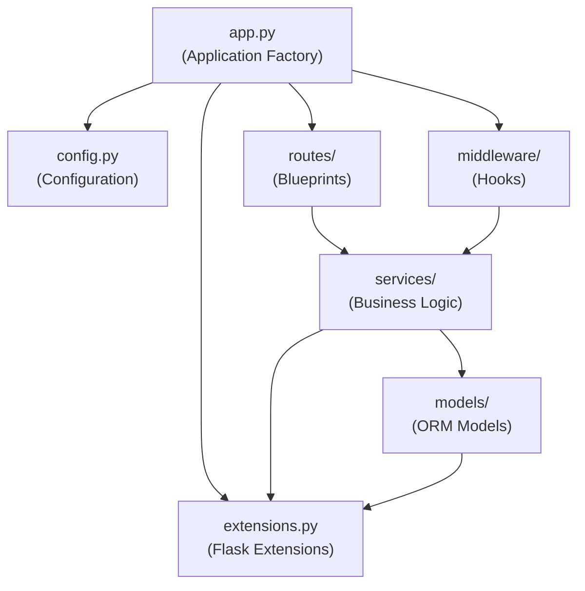

# Architecture Overview

*Last updated: 2026-02-24*

This document provides a comprehensive overview of the Flask server application's architecture, including the system design, component responsibilities, technology stack, and foundational terminology used throughout all project documentation. It is intended for all developers working on or consuming the Flask server application and serves as the architectural reference point for the entire project.

## System Overview

The Flask server is a Python 3 web application built with the Flask framework. It serves as a complete rewrite of the original Node.js server, preserving all original functionalities while adopting Python-native patterns and libraries. The server exposes REST API endpoints for client applications, handling authentication, data persistence, business logic, and resource management.

The application follows a layered architecture approach. Each layer has a clearly defined responsibility, and communication flows strictly downward through the stack: the presentation layer (blueprints and route handlers) accepts incoming HTTP requests, delegates work to the business logic layer (services), which in turn interacts with the data access layer (models and ORM) for persistence. Cross-cutting concerns such as authentication, CORS, and logging are handled by middleware hooks that execute outside the main request-handling path.

## Component Architecture

The following diagram illustrates the high-level components of the Flask server and their relationships:



### Component Descriptions

- **Client / Consumer** — External applications or users that make HTTP requests to the server. Clients interact exclusively through the REST API surface exposed by the Flask application.

- **Flask Application** — The core application instance created by the application factory (`create_app()`). It is responsible for loading configuration, initializing Flask extensions, registering blueprints, and attaching middleware hooks.

- **Blueprints / Routes** — Flask blueprint modules that define URL route patterns and request handler functions. Blueprints are organized by resource domain (for example, `users`, `auth`, `resources`), enabling modular development and clear URL namespace separation.

- **Service Layer** — Python modules containing business logic, data validation, and orchestration of database operations. The service layer is decoupled from HTTP transport concerns, making it independently testable and reusable across different entry points.

- **Database** — Persistent data storage accessed through the SQLAlchemy ORM. Database schema is managed by Flask-SQLAlchemy for model definitions and Flask-Migrate (backed by Alembic) for schema migrations.

- **Middleware** — Cross-cutting concerns implemented as Flask `before_request` and `after_request` hooks. Middleware functions execute on every request to handle authentication, CORS, and logging without duplicating logic in individual route handlers.

- **Authentication** — JWT-based token validation that executes on every request requiring authorization. The authentication middleware extracts the token from the `Authorization` header, verifies it, and stores the authenticated user identity in the Flask request context (`flask.g`).

- **CORS Handler** — Cross-Origin Resource Sharing configuration provided by Flask-CORS. Controls which external origins, HTTP methods, and headers are permitted when clients make cross-origin requests.

- **Request Logger** — Request and response logging for observability and debugging. Captures method, path, status code, and response time for every request processed by the server.

## Technology Stack

The following table lists all core technologies used in the Flask server application. Versions are based on the latest stable releases as of February 2026.

| Category | Technology | Version | Purpose |
|---|---|---|---|
| Language | Python | 3.9+ | Primary programming language |
| Framework | Flask | 3.1.3 | Web application framework |
| ORM | SQLAlchemy | via Flask-SQLAlchemy 3.1.1 | Object-Relational Mapping for database access |
| Database Migrations | Alembic | via Flask-Migrate 4.0.7 | Database schema migration management |
| CORS | Flask-CORS | 6.0.2 | Cross-Origin Resource Sharing support |
| Configuration | python-dotenv | 1.0.1 | Environment variable management from `.env` files |
| WSGI Server | Gunicorn | 23.0.0 | Production HTTP server |
| Testing | pytest | 8.3.4 | Test framework and runner |
| Documentation | MkDocs | 1.6.1 | Documentation site generator |
| Doc Theme | mkdocs-material | 9.7.2 | Material Design documentation theme |

> **Note:** Python 3.9+ denotes the minimum supported Python version. All other version numbers refer to specific pinned releases used by the project.

## Layered Architecture

The Flask server is organized into four distinct layers, each with a single responsibility. This separation ensures that changes to one layer have minimal impact on others and that each layer can be developed and tested independently.

### Presentation Layer (Blueprints / Routes)

The presentation layer handles the HTTP request/response lifecycle. Route handler functions extract data from incoming requests, invoke the appropriate service functions, and format the results as JSON responses with the correct HTTP status codes.

**Responsibilities:**

- Define URL route patterns using Flask blueprints
- Parse and validate incoming request data (JSON body, query parameters, path parameters, headers)
- Delegate all business logic to the service layer
- Construct and return HTTP responses with appropriate status codes

**Example — Blueprint definition:**

```python
from flask import Blueprint, jsonify, request
from services import user_service

users_bp = Blueprint("users", __name__)

@users_bp.route("/", methods=["GET"])
def list_users():
    page = request.args.get("page", 1, type=int)
    per_page = request.args.get("per_page", 20, type=int)
    result = user_service.get_all(page=page, per_page=per_page)
    return jsonify({"status": "success", "data": result}), 200
```

### Business Logic Layer (Services)

The business logic layer encapsulates domain-specific rules, data transformations, and orchestration of data-layer interactions. Service modules are called by route handlers and are fully decoupled from HTTP concerns such as request parsing or response formatting.

**Responsibilities:**

- Implement core business rules and validations
- Coordinate multi-step operations within database transactions
- Transform data between API representations and database model instances
- Raise domain-specific exceptions for error cases

**Example — Service function:**

```python
# services/user_service.py
from models.user import User
from extensions import db

def create_user(email, name, role="user"):
    if User.query.filter_by(email=email).first():
        raise ValueError("Email already registered")
    user = User(email=email, name=name, role=role)
    db.session.add(user)
    db.session.commit()
    return user.to_dict()
```

### Data Access Layer (Models)

The data access layer consists of SQLAlchemy ORM model classes that map directly to database tables. Models define the database schema (columns, types, constraints), provide serialization methods for API responses, and encapsulate query helpers for common data access patterns.

**Responsibilities:**

- Define database schema using SQLAlchemy model classes
- Provide serialization methods (`to_dict()`) for converting model instances to JSON-compatible dictionaries
- Define relationships between entities using foreign keys, backrefs, and association tables
- Implement query helper methods (class methods or module-level functions) for common data access patterns

**Example — Model definition:**

```python
# models/user.py
from extensions import db

class User(db.Model):
    __tablename__ = "users"

    id = db.Column(db.Integer, primary_key=True)
    email = db.Column(db.String(255), unique=True, nullable=False)
    name = db.Column(db.String(255), nullable=False)
    role = db.Column(db.String(50), default="user")
    created_at = db.Column(db.DateTime, server_default=db.func.now())

    def to_dict(self):
        return {
            "id": self.id,
            "email": self.email,
            "name": self.name,
            "role": self.role,
            "created_at": self.created_at.isoformat() if self.created_at else None,
        }
```

### Cross-Cutting Concerns (Middleware)

Cross-cutting concerns are handled by Flask `before_request` and `after_request` hook functions. These hooks execute on every request and address responsibilities that span multiple layers, preventing duplication of logic across individual route handlers.

**Responsibilities:**

- Request authentication and authorization (JWT token validation, user identity injection)
- CORS header management (handled transparently by Flask-CORS)
- Request and response logging (method, path, status code, response time)
- Error handling and exception translation (converting uncaught exceptions into structured JSON error responses)

**Example — Middleware hooks:**

```python
# middleware/request_logger.py
from flask import request, g
import time

def register_logger(app):
    @app.before_request
    def start_timer():
        g.start_time = time.time()

    @app.after_request
    def log_request(response):
        duration = time.time() - g.get("start_time", time.time())
        app.logger.info(
            "%s %s %s %.3fs",
            request.method,
            request.path,
            response.status_code,
            duration,
        )
        return response
```

## Module Dependency Graph

The following diagram shows how the application's modules depend on each other. Arrows point from the dependent module to its dependency.



### Dependency Flow

- **`app.py`** depends on `config.py` for configuration loading, `extensions.py` for Flask extension initialization (SQLAlchemy, Migrate, CORS), `routes/` for blueprint registration, and `middleware/` for attaching request hooks.
- **`routes/`** (blueprint modules) depend on `services/` for business logic execution. Route handlers never access models or the database directly.
- **`services/`** depend on `models/` for data access through ORM queries and on `extensions.py` for the shared `db` session instance used in transactions.
- **`models/`** depend on `extensions.py` for the SQLAlchemy `db` instance that provides `db.Model` as the base class and `db.Column` for column definitions.
- **`middleware/`** depends on `services/` for operations such as authentication token verification, where the middleware calls an auth service function to validate credentials.

## Design Principles

The following design principles guide the architecture and implementation of the Flask server:

1. **Separation of Concerns** — Each layer handles a single aspect of the application. Route handlers do not contain business logic; services do not construct HTTP responses; models do not implement validation rules that belong to the service layer.

2. **Application Factory Pattern** — The Flask application is created through a `create_app()` factory function rather than as a module-level global. This pattern enables flexible configuration for different environments (development, testing, production) and simplifies testing by allowing fresh application instances per test.

3. **Blueprint-Based Organization** — Routes are organized into Flask blueprints grouped by resource domain. Each blueprint owns a URL prefix (for example, `/api/users`) and encapsulates all route handlers for that domain, enabling independent development and clear namespace management.

4. **Service Layer Pattern** — All business logic is encapsulated in service modules that are decoupled from the HTTP transport layer. Services accept plain Python arguments, return dictionaries or raise exceptions, and can be called from route handlers, CLI commands, or background tasks without modification.

5. **Configuration via Environment** — All configuration values are loaded from environment variables using `python-dotenv`, with sensible defaults for development. No secrets or environment-specific values are hard-coded in source files. Configuration classes provide typed access to settings.

6. **Feature Parity** — This Flask application preserves all functionalities from the original Node.js server, mapped to Python and Flask equivalents. The [Migration Guide](../guides/migration-from-nodejs.md) documents each mapping in detail, ensuring that every feature, endpoint, and behavior is accounted for in the rewrite.

## Module Responsibilities

The table below summarizes each module's path and its responsibility within the application:

| Module | Path | Responsibility |
|---|---|---|
| Application Factory | `app.py` | Creates and configures the Flask application instance; registers blueprints, initializes extensions, and attaches middleware hooks |
| Configuration | `config.py` | Defines configuration classes for different environments (development, testing, production); loads environment variables via `python-dotenv` |
| Extensions | `extensions.py` | Initializes Flask extensions (SQLAlchemy, Migrate, CORS) as module-level instances that are imported by other modules and bound to the app in the factory |
| Blueprints | `routes/` | Defines URL route patterns and request handler functions, organized by resource domain (for example, `routes/users.py`, `routes/auth.py`) |
| Services | `services/` | Contains business logic functions, data validation, and database operation orchestration; called by route handlers and middleware |
| Models | `models/` | Defines SQLAlchemy ORM model classes representing database tables, with serialization methods (`to_dict()`) and relationship definitions |
| Middleware | `middleware/` | Implements `before_request` and `after_request` hooks for authentication, request logging, and CORS enforcement |
| Tests | `tests/` | Contains pytest test modules for unit tests, integration tests, and API endpoint tests using Flask's test client |

## Glossary

This glossary defines the standard terminology used throughout all project documentation. All documentation files reference these definitions to maintain consistency.

| Term | Definition |
|---|---|
| **Endpoint** | A REST API route exposed by the server, identified by an HTTP method and URL path (for example, `GET /api/users`). Implemented as Flask view functions within blueprints. |
| **Blueprint** | A Flask organizational unit that groups related route handlers under a shared URL prefix. Used to modularize the application by resource domain (for example, `users_bp`, `auth_bp`). |
| **Model** | A SQLAlchemy ORM class that maps to a database table. Models define the schema (columns, types, constraints) and provide data access and serialization methods. |
| **Service** | A Python module or function in the `services/` directory that encapsulates business logic. Services are called by route handlers and interact with models for data operations. |
| **Middleware** | Flask `before_request` and `after_request` hook functions that execute on every request for cross-cutting concerns like authentication, logging, and CORS. |
| **Application Factory** | The `create_app()` function pattern that constructs and configures a Flask application instance, enabling different configurations for development, testing, and production. |
| **ORM** | Object-Relational Mapping — the technique of mapping Python classes (models) to database tables, provided by SQLAlchemy via Flask-SQLAlchemy. |
| **Blueprint URL Prefix** | The base URL path prepended to all routes within a blueprint (for example, registering `users_bp` with prefix `/api/users` makes all its routes accessible under that path). |
| **Request Context** | The Flask request-scoped context (via `flask.g`) that holds per-request data such as the authenticated user, start timestamp, and other request-specific state. |

## See Also

- [Request Lifecycle](request-lifecycle.md) — Full request processing sequence from client to response
- [Data Flow](data-flow.md) — Data movement between client, API, service, and database layers
- [Migration Guide](../guides/migration-from-nodejs.md) — Node.js to Flask concept mapping and equivalence tables
- [API Reference](../api-reference/endpoints.md) — Complete REST API endpoint catalog
- [Getting Started](../getting-started/installation.md) — Installation and setup instructions
