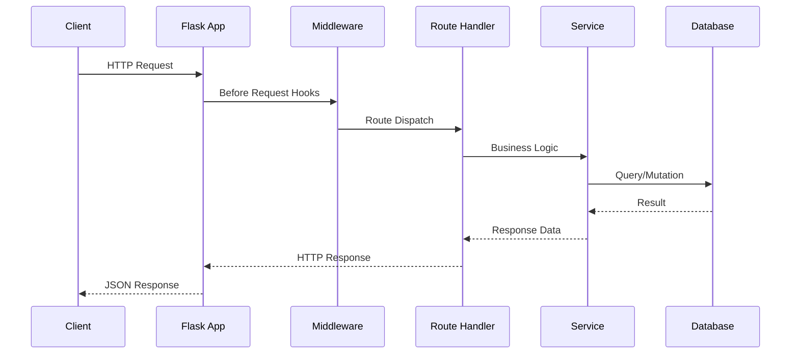
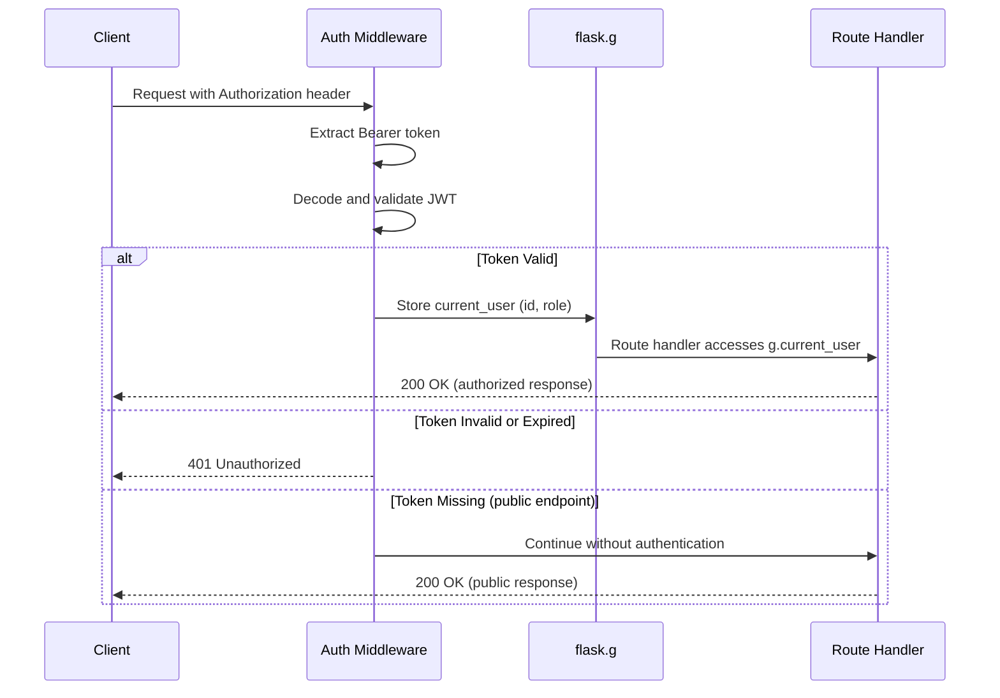

# Request Lifecycle

*Last updated: 2026-02-24*

This document describes the complete lifecycle of an HTTP request and response as it flows through the Flask server application. It covers every processing stage from the moment a client initiates an HTTP request to the delivery of a JSON response, including middleware execution, route dispatch, service layer invocation, database interaction, and response formatting. The intended audience is developers implementing, extending, or debugging the Flask application's request handling pipeline. For standard terminology used throughout this document, see the [glossary in the Architecture Overview](overview.md).

## Request Lifecycle Overview

Every HTTP request processed by the Flask server passes through seven sequential stages. Understanding these stages is essential for debugging request failures, implementing new middleware, and extending the application with additional endpoints or services.

The seven stages are:

1. **Client Request Initiation** — The client constructs and sends an HTTP request to the server, specifying the method, URL path, headers, and an optional request body.
2. **Flask Application Entry** — The Werkzeug WSGI layer receives the raw request and constructs a Flask `Request` object. Flask's URL router matches the request path against registered route rules in blueprints.
3. **Before Request Hooks (Middleware)** — All registered `before_request` hook functions execute in registration order. These hooks handle cross-cutting concerns such as request logging, authentication validation, and CORS preflight processing.
4. **Route Dispatch** — Flask dispatches the request to the matched blueprint view function (route handler). The handler extracts request data and delegates to the service layer.
5. **Service Layer Processing** — The service module executes business logic, performs data validation, and orchestrates database operations. Services are decoupled from HTTP concerns.
6. **Database Interaction** — SQLAlchemy ORM queries execute against the database through the request-scoped session managed by Flask-SQLAlchemy. Transactions commit on success or roll back on exception.
7. **Response Delivery** — The route handler constructs a JSON response. All registered `after_request` hooks execute (response logging, security headers, CORS headers), and Flask delivers the final HTTP response to the client.

Flask uses the WSGI (Web Server Gateway Interface) protocol, implemented by the Werkzeug library, to receive incoming HTTP requests from the production WSGI server (Gunicorn). Werkzeug handles the low-level HTTP parsing, connection management, and request object construction before passing control to the Flask application.

## Request Flow Diagram

The following sequence diagram illustrates the complete request/response flow through all major components of the Flask server:



### Diagram Participant Descriptions

- **Client** — The external application or user that initiates the HTTP request. Clients interact with the server exclusively through the REST API surface.
- **Flask App** — The core Flask application instance created by the application factory (`create_app()`). It receives the incoming request, manages the middleware chain, and delivers the final response.
- **Middleware** — The collection of `before_request` and `after_request` hook functions that handle cross-cutting concerns such as authentication, logging, and CORS. Middleware executes on every request.
- **Route Handler** — The blueprint view function matched by Flask's URL router. It extracts data from the request, invokes the appropriate service function, and constructs the HTTP response.
- **Service** — The business logic module called by the route handler. Services encapsulate domain rules, data validation, and database operation orchestration.
- **Database** — The persistent data store accessed through SQLAlchemy ORM queries. Flask-SQLAlchemy manages the request-scoped database session lifecycle.

### Arrow Descriptions

- **Client → Flask App (HTTP Request)** — The client sends an HTTP request with a method, URL, headers, and optional body.
- **Flask App → Middleware (Before Request Hooks)** — Flask invokes all registered `before_request` hooks before dispatching to the route handler.
- **Middleware → Route Handler (Route Dispatch)** — After middleware completes without returning a response, Flask dispatches the request to the matched view function.
- **Route Handler → Service (Business Logic)** — The route handler delegates all business logic to the service layer, passing parsed request data as plain Python arguments.
- **Service → Database (Query/Mutation)** — The service executes SQLAlchemy ORM queries or mutations against the database.
- **Database → Service (Result)** — The database returns query results or confirms mutation success to the service layer.
- **Service → Route Handler (Response Data)** — The service returns processed data (typically as a dictionary) to the route handler.
- **Route Handler → Flask App (HTTP Response)** — The route handler returns a response tuple (JSON body and status code) to Flask. Flask then runs all `after_request` hooks.
- **Flask App → Client (JSON Response)** — Flask delivers the final HTTP response, including headers added by `after_request` hooks, to the client.

## Processing Stages

### Client Request Initiation

The request lifecycle begins when a client sends an HTTP request to the Flask server. The client specifies:

- **HTTP method** — `GET`, `POST`, `PUT`, `PATCH`, or `DELETE`, indicating the desired operation.
- **URL path** — The endpoint path (for example, `/api/users` or `/api/users/42`) identifying the target resource.
- **Headers** — Metadata including `Content-Type` (typically `application/json`), `Authorization` (Bearer token for authenticated requests), and any custom headers.
- **Request body** (optional) — A JSON payload containing data for `POST`, `PUT`, and `PATCH` operations.

Example request using curl:

```bash
curl -X GET http://localhost:5000/api/users \
  -H "Authorization: Bearer <token>" \
  -H "Content-Type: application/json"
```

Example POST request with a JSON body:

```bash
curl -X POST http://localhost:5000/api/users \
  -H "Authorization: Bearer <token>" \
  -H "Content-Type: application/json" \
  -d '{"email": "user@example.com", "name": "New User"}'
```

### Flask Application Entry

When the HTTP request reaches the server, the Werkzeug WSGI layer parses the raw HTTP data and constructs a Flask `Request` object. This object provides convenient access to headers, query parameters, path parameters, and the parsed JSON body through the `flask.request` proxy.

Flask then performs URL routing: it matches the request's URL path and HTTP method against all registered route rules. Route rules are defined within blueprints, which are registered with the application during initialization in the application factory.

The application factory pattern creates and configures the Flask application instance, registering all blueprints with their URL prefixes:

```python
from flask import Flask

def create_app():
    app = Flask(__name__)
    app.config.from_object("config.Config")

    from routes.users import users_bp
    app.register_blueprint(users_bp, url_prefix="/api/users")

    return app
```

In this example, a request to `GET /api/users/` is matched to the `users_bp` blueprint because the blueprint is registered with the URL prefix `/api/users`. Flask strips the prefix and matches the remaining path (`/`) against the blueprint's route rules.

If no route matches the URL path and method combination, Flask immediately returns a `404 Not Found` response without invoking any `before_request` hooks or route handlers.

### Before Request Hooks

Before dispatching the request to the matched route handler, Flask executes all registered `before_request` hook functions in the order they were registered. These hooks implement cross-cutting middleware concerns that apply to every request.

Typical `before_request` hooks in the Flask server include:

- **Request logging** — Records the HTTP method, URL path, and timestamp at the start of request processing for observability.
- **Authentication validation** — Extracts the JWT token from the `Authorization` header, verifies its signature and expiration, and stores the decoded user identity in the Flask request context (`flask.g`).
- **CORS preflight handling** — Processes `OPTIONS` preflight requests for Cross-Origin Resource Sharing (handled transparently by Flask-CORS in most cases).
- **Request body validation** — Validates that the request content type and body format match expectations before the route handler executes.

```python
from flask import request, g
import time

@app.before_request
def log_request():
    g.start_time = time.time()
    app.logger.info(f"{request.method} {request.path}")

@app.before_request
def authenticate():
    token = request.headers.get("Authorization")
    if token:
        g.current_user = verify_token(token)
```

**Error short-circuiting:** If any `before_request` hook returns a response (instead of `None`), Flask immediately stops executing subsequent hooks and the route handler. The returned response is sent directly to the client. This pattern is used for authentication failures — when a token is invalid or missing on a protected endpoint, the authentication hook returns a `401 Unauthorized` response, and the route handler never executes.

```python
@app.before_request
def require_auth():
    public_paths = ["/api/auth/login", "/api/auth/register", "/health"]
    if request.path in public_paths:
        return None

    token = request.headers.get("Authorization", "").replace("Bearer ", "")
    if not token:
        return jsonify({"status": "error", "message": "Missing authentication token"}), 401

    payload = decode_token(token)
    if payload is None:
        return jsonify({"status": "error", "message": "Invalid or expired token"}), 401

    g.current_user = {"id": payload["sub"], "role": payload.get("role", "user")}
```

### Route Dispatch

After all `before_request` hooks complete without returning a response, Flask dispatches the request to the matched blueprint view function (route handler). The dispatch process involves:

1. **URL matching** — Flask's URL map (built from all registered blueprints) matches the request path to a specific route rule.
2. **HTTP method matching** — The matched route must accept the request's HTTP method (specified in the `methods` parameter of `@blueprint.route()`).
3. **URL converter extraction** — Dynamic segments in the URL path (for example, `<int:user_id>`) are extracted, type-converted, and passed as keyword arguments to the view function.

```python
from flask import Blueprint, jsonify, request

users_bp = Blueprint("users", __name__)

@users_bp.route("/", methods=["GET"])
def get_users():
    page = request.args.get("page", 1, type=int)
    users = user_service.get_all_users(page=page)
    return jsonify(users), 200

@users_bp.route("/<int:user_id>", methods=["GET"])
def get_user(user_id):
    user = user_service.get_user_by_id(user_id)
    if not user:
        return jsonify({"status": "error", "message": "User not found"}), 404
    return jsonify({"status": "success", "data": user}), 200
```

Flask provides several built-in URL converters for path parameters:

| Converter | Description | Example |
|---|---|---|
| `string` | Accepts any text without slashes (default) | `<username>` |
| `int` | Accepts positive integers | `<int:user_id>` |
| `float` | Accepts positive floating-point values | `<float:price>` |
| `path` | Accepts text including slashes | `<path:file_path>` |
| `uuid` | Accepts UUID strings | `<uuid:item_id>` |

Route handlers are responsible for extracting data from the request, calling the appropriate service function, and returning an HTTP response. Route handlers never contain business logic directly — they delegate all domain operations to the service layer.

### Service Layer Invocation

Route handlers delegate all business logic to service modules. The service layer encapsulates domain-specific rules, data validation, transformation logic, and orchestration of database operations. Services accept plain Python arguments (not Flask request objects) and return dictionaries or raise exceptions, making them independently testable and reusable.

```python
# services/user_service.py
from models.user import User
from extensions import db

def get_all_users(page=1, per_page=20):
    pagination = User.query.paginate(page=page, per_page=per_page)
    return {
        "users": [user.to_dict() for user in pagination.items],
        "total": pagination.total,
        "page": pagination.page,
        "pages": pagination.pages,
    }

def get_user_by_id(user_id):
    user = db.session.get(User, user_id)
    if not user:
        return None
    return user.to_dict()

def create_user(email, name, role="user"):
    if User.query.filter_by(email=email).first():
        raise ValueError("Email already registered")
    user = User(email=email, name=name, role=role)
    db.session.add(user)
    db.session.commit()
    return user.to_dict()
```

Key design principles for the service layer:

- **No HTTP dependency** — Services never import `flask.request`, `flask.jsonify`, or any HTTP-related module. They work with plain Python types.
- **Exception-based error signaling** — Services raise Python exceptions (such as `ValueError` or custom domain exceptions) for error cases. Route handlers catch these exceptions and translate them to appropriate HTTP responses.
- **Single responsibility** — Each service function performs one cohesive operation. Complex workflows are composed from multiple service calls within the route handler.

### Database Interaction

The service layer interacts with the database through SQLAlchemy ORM model classes managed by Flask-SQLAlchemy. Flask-SQLAlchemy provides a request-scoped database session that is automatically created at the start of each request and torn down at the end.

```python
from models.user import User
from extensions import db

def update_user(user_id, name=None, role=None):
    user = db.session.get(User, user_id)
    if not user:
        raise ValueError("User not found")

    if name is not None:
        user.name = name
    if role is not None:
        user.role = role

    db.session.commit()
    return user.to_dict()
```

**Transaction management:**

- **Auto-commit on success** — When `db.session.commit()` is called and no exception occurs, the transaction is committed to the database.
- **Rollback on exception** — If an unhandled exception propagates during request processing, Flask-SQLAlchemy automatically rolls back the session to prevent partial writes from persisting.
- **Explicit rollback** — Service functions can call `db.session.rollback()` explicitly to discard changes within a try/except block before raising a different exception.

**Session lifecycle:**

- Flask-SQLAlchemy creates a new scoped session for each incoming request.
- The session is bound to the current application context and is accessible via `db.session`.
- At the end of the request (after `after_request` hooks complete), Flask-SQLAlchemy removes the session, closing the database connection back to the pool.

### Response Formatting

After the service layer returns data to the route handler, the handler constructs an HTTP response. Flask provides the `jsonify()` function to serialize Python dictionaries into JSON response bodies with the correct `Content-Type: application/json` header.

```python
from flask import jsonify

# Success response with data
return jsonify({"status": "success", "data": result}), 200

# Created response
return jsonify({"status": "success", "data": new_resource}), 201

# No content response (for DELETE operations)
return "", 204

# Error response
return jsonify({"status": "error", "message": "Not found"}), 404
```

The Flask server uses consistent HTTP status codes across all endpoints:

| Status Code | Meaning | Usage |
|---|---|---|
| `200 OK` | Request succeeded | Successful GET, PUT, PATCH requests |
| `201 Created` | Resource created | Successful POST requests that create a resource |
| `204 No Content` | Success with no body | Successful DELETE requests |
| `400 Bad Request` | Invalid request data | Missing required fields, validation errors |
| `401 Unauthorized` | Authentication required | Missing or invalid JWT token |
| `403 Forbidden` | Insufficient permissions | Valid token but insufficient role |
| `404 Not Found` | Resource not found | Requested resource does not exist |
| `500 Internal Server Error` | Unexpected server error | Unhandled exceptions |

### After Request Hooks

After the route handler returns a response (or an error handler produces one), Flask executes all registered `after_request` hook functions. Each hook receives the response object and must return it (optionally modified).

Typical `after_request` hooks include:

- **Response logging** — Records the response status code and total request processing time for observability.
- **CORS header injection** — Adds Cross-Origin Resource Sharing headers to every response (typically handled by Flask-CORS automatically).
- **Security header addition** — Injects security-related headers such as `X-Content-Type-Options`, `X-Frame-Options`, and `Strict-Transport-Security`.

```python
import time
from flask import g

@app.after_request
def log_response(response):
    duration = time.time() - g.get("start_time", time.time())
    app.logger.info(f"Response {response.status_code} in {duration:.3f}s")
    return response

@app.after_request
def add_security_headers(response):
    response.headers["X-Content-Type-Options"] = "nosniff"
    response.headers["X-Frame-Options"] = "DENY"
    return response
```

After all `after_request` hooks complete, Flask delivers the final HTTP response to the client through the WSGI server (Gunicorn in production). The response includes the status code, all headers (including those added by hooks), and the JSON body.

## Error Handling

Error handling is distributed across every stage of the request lifecycle. The Flask server employs a layered error handling strategy to ensure that all failures produce structured JSON error responses rather than HTML error pages.

**Before Request Hooks:**
If authentication validation fails in a `before_request` hook, the hook returns a `401 Unauthorized` JSON response immediately. This short-circuits the request — subsequent hooks and the route handler are never executed.

**Route Dispatch:**
If the URL path does not match any registered route, Flask automatically returns a `404 Not Found` response. If the HTTP method is not allowed for a matched route, Flask returns a `405 Method Not Allowed` response. Both are intercepted by registered error handlers (below) to produce JSON responses.

**Service Layer:**
Business logic exceptions raised in the service layer propagate up to the route handler. Route handlers catch domain-specific exceptions and translate them into HTTP error responses:

```python
@users_bp.route("/", methods=["POST"])
def create_user():
    data = request.get_json()
    try:
        user = user_service.create_user(
            email=data.get("email"),
            name=data.get("name"),
        )
        return jsonify({"status": "success", "data": user}), 201
    except ValueError as e:
        return jsonify({"status": "error", "message": str(e)}), 400
```

**Database:**
SQLAlchemy exceptions (such as `IntegrityError` for unique constraint violations or `OperationalError` for connection failures) trigger an automatic transaction rollback by Flask-SQLAlchemy. If not caught by the service layer, these exceptions propagate to the global error handler.

**Global Error Handlers:**
Flask error handlers registered with `@app.errorhandler()` catch any unhandled exceptions and produce structured JSON responses. These serve as the final safety net:

```python
from flask import jsonify

@app.errorhandler(400)
def bad_request(error):
    return jsonify({"status": "error", "message": "Bad request"}), 400

@app.errorhandler(404)
def not_found(error):
    return jsonify({"status": "error", "message": "Resource not found"}), 404

@app.errorhandler(405)
def method_not_allowed(error):
    return jsonify({"status": "error", "message": "Method not allowed"}), 405

@app.errorhandler(500)
def internal_error(error):
    db.session.rollback()
    return jsonify({"status": "error", "message": "Internal server error"}), 500

@app.errorhandler(Exception)
def handle_unexpected_error(error):
    app.logger.error(f"Unhandled exception: {error}")
    db.session.rollback()
    return jsonify({"status": "error", "message": "An unexpected error occurred"}), 500
```

The error handling hierarchy ensures that:

1. Expected errors (validation failures, missing resources) produce specific, informative error messages with appropriate 4xx status codes.
2. Unexpected errors (unhandled exceptions) are logged, trigger a database rollback, and produce a generic 500 response without leaking internal details to the client.
3. Every error response follows the same JSON structure (`{"status": "error", "message": "..."}`) for consistent client-side error handling.

## Authentication Flow

Authentication integrates into the request lifecycle through a `before_request` hook that executes on every incoming request. The following steps describe how authentication is processed:

1. **Token extraction** — The `before_request` hook reads the `Authorization` header from the incoming request. If the header is present and starts with `Bearer `, the token string is extracted.
2. **Token validation** — The JWT token is decoded and validated using the server's secret key. The validation checks the token's signature, expiration time (`exp` claim), and structure.
3. **Identity injection** — If the token is valid, the decoded payload (containing the user ID and role) is stored in `flask.g.current_user`. The `flask.g` object is a request-scoped context that persists for the duration of the current request.
4. **Authorization access** — Route handlers and service functions access `g.current_user` to determine the authenticated user's identity and role for authorization decisions.
5. **Failure handling** — If the token is missing on a protected endpoint, malformed, or expired, the `before_request` hook returns a `401 Unauthorized` response immediately, preventing the route handler from executing.



Public endpoints (such as login, registration, and health check) bypass authentication. The middleware identifies public endpoints by checking the request path or Flask endpoint name against a whitelist and returns `None` to allow the request to proceed without a token.

For complete details on JWT token generation, refresh flows, route protection decorators, and error scenarios, see the [Authentication Guide](../guides/authentication.md).

## See Also

- [Architecture Overview](overview.md) — System component descriptions, technology stack, and terminology glossary
- [Data Flow](data-flow.md) — Detailed data movement patterns between client, API, service, and database layers
- [Authentication Guide](../guides/authentication.md) — Complete JWT authentication setup, token management, and protected route configuration
- [API Reference](../api-reference/endpoints.md) — REST API endpoint catalog with request/response schemas and examples
