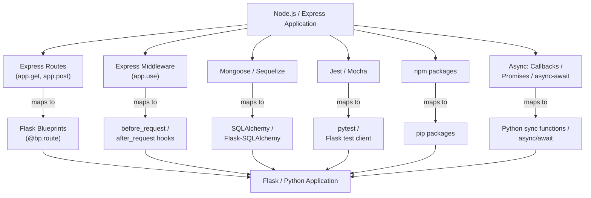

# Migration from Node.js to Flask

*Last updated: 2026-02-24*

This guide provides a comprehensive, bidirectional mapping between Node.js/Express concepts and Flask/Python equivalents, enabling developers from either ecosystem to understand the architectural translation and maintain complete feature parity. Whether you are a Node.js developer learning how the Flask server works, or a Python developer understanding how the original Node.js patterns were translated, every section can be read in both directions — Node.js to Flask and Flask to Node.js.

## Migration Overview

This Flask application is a complete rewrite of an existing Node.js/Express server. All original functionalities are preserved with full feature parity — every endpoint, middleware, model, and service from the Node.js codebase has a direct equivalent in the Flask application. The migration translates JavaScript/Node.js patterns to Python 3/Flask equivalents while adopting Python-native idioms and Flask best practices.

This document is organized by concept category. Each section provides:

- A **side-by-side comparison table** mapping Node.js concepts to Flask equivalents (readable in both directions)
- **Working code examples** in both JavaScript (Express) and Python (Flask)
- **Key differences** highlighting where the two ecosystems diverge

The terminology used throughout this guide — *endpoint*, *blueprint*, *model*, *service*, and *middleware* — follows the definitions established in the [Architecture Overview glossary](../architecture/overview.md#glossary).

## Migration Flowchart

The following diagram illustrates how each major component of the Node.js/Express application maps to its Flask/Python equivalent:



At a high level, the migration follows a one-to-one structural mapping. Each Express route group becomes a Flask blueprint. Each Express middleware function becomes a Flask `before_request` or `after_request` hook. The Mongoose or Sequelize ORM layer is replaced by SQLAlchemy via Flask-SQLAlchemy. The Jest or Mocha test suite is replaced by pytest with Flask's built-in test client. npm packages are replaced by their pip equivalents, and Node.js asynchronous patterns (callbacks, Promises, `async`/`await`) are translated to Python's synchronous execution model or, where appropriate, Python's native `async`/`await` syntax.

## Framework Comparison

The table below maps core framework concepts between Node.js/Express and Flask/Python. Each row is **bidirectional** — read left-to-right to translate from Node.js to Flask, or right-to-left to translate from Flask to Node.js.

| Concept | Node.js / Express | Flask / Python | Notes |
|---|---|---|---|
| Runtime | Node.js (V8 engine) | Python 3.9+ (CPython) | Different concurrency models: event-loop vs thread-per-request |
| Web framework | Express.js | Flask 3.1.3 | Both are minimalist micro-frameworks with extension ecosystems |
| Package manager | npm / yarn | pip / pipenv | `package.json` maps to `requirements.txt` |
| Application entry | `index.js` / `server.js` | `app.py` / `wsgi.py` | Flask uses the application factory pattern (`create_app()`) |
| Route definition | `app.get("/path", handler)` | `@app.route("/path", methods=["GET"])` | Flask uses Python decorators instead of method chaining |
| Route grouping | `express.Router()` | `Flask Blueprint` | Blueprints provide URL prefix scoping and modularity |
| Middleware | `app.use(middleware)` | `@app.before_request` / `@app.after_request` | Flask hooks execute on every request within their scope |
| Request object | `req` parameter | `flask.request` (global proxy) | Flask uses a thread-local context proxy instead of a parameter |
| Response | `res.json()` / `res.send()` | `flask.jsonify()` / `return` | Flask view functions return response tuples or Response objects |
| Template engine | EJS / Pug / Handlebars | Jinja2 (built-in) | Both support template inheritance and filters |
| Static files | `express.static()` | `flask.send_static_file()` | Flask serves from the `/static` directory by default |
| Environment vars | `dotenv` / `process.env` | `python-dotenv` / `os.environ` | Both use `.env` files with identical patterns |
| Production server | Node.js itself / PM2 | Gunicorn 23.0.0 / uWSGI | Node.js is its own HTTP server; Flask requires a WSGI server |
| Process manager | PM2 / forever | systemd / supervisor | Different process management tooling for production |

## Route Mapping

Express route definitions translate directly to Flask blueprint route decorators. The core differences are: Flask uses Python decorators instead of method chaining, Flask uses `<type:name>` URL converters instead of `:name` parameters, and Flask view functions return response data instead of calling methods on a response object.

### Node.js / Express

```javascript
const express = require("express");
const router = express.Router();

router.get("/users", (req, res) => {
    const users = getUsersFromDB();
    res.json({ data: users });
});

router.post("/users", (req, res) => {
    const user = createUser(req.body);
    res.status(201).json(user);
});

router.get("/users/:id", (req, res) => {
    const user = getUserById(req.params.id);
    if (!user) return res.status(404).json({ error: "Not found" });
    res.json(user);
});

module.exports = router;
```

### Flask / Python

```python
from flask import Blueprint, request, jsonify

users_bp = Blueprint("users", __name__)

@users_bp.route("/", methods=["GET"])
def get_users():
    users = get_users_from_db()
    return jsonify({"data": users}), 200

@users_bp.route("/", methods=["POST"])
def create_user():
    user = create_user_service(request.get_json())
    return jsonify(user), 201

@users_bp.route("/<int:user_id>", methods=["GET"])
def get_user(user_id):
    user = get_user_by_id(user_id)
    if not user:
        return jsonify({"error": "Not found"}), 404
    return jsonify(user), 200
```

### Key Differences

| Express Pattern | Flask Equivalent | Explanation |
|---|---|---|
| `router.get("/path", handler)` | `@bp.route("/path", methods=["GET"])` | Flask uses decorators; the HTTP method is specified in `methods=[]` |
| `req.params.id` | Function argument `user_id` | Flask injects URL parameters as function arguments via converters |
| `:id` (URL parameter) | `<int:user_id>` (URL converter) | Flask converters provide built-in type validation (`int`, `string`, `float`, `uuid`) |
| `res.json(data)` | `return jsonify(data), 200` | Flask view functions return a tuple of `(response_body, status_code)` |
| `res.status(201).json(data)` | `return jsonify(data), 201` | Status codes are the second element of the return tuple |
| `module.exports = router` | Blueprint registered via `app.register_blueprint()` | Blueprints are registered in the application factory |

## Middleware Mapping

Express middleware functions registered with `app.use()` translate to Flask `before_request` and `after_request` hooks. The key difference is that Express middleware uses an explicit `next()` callback to pass control to the next handler, while Flask hooks return `None` to continue processing or return a response to short-circuit the request.

### Express Middleware

```javascript
app.use((req, res, next) => {
    console.log(`${req.method} ${req.path}`);
    req.startTime = Date.now();
    next();
});

app.use((req, res, next) => {
    res.on("finish", () => {
        const duration = Date.now() - req.startTime;
        console.log(`Response ${res.statusCode} in ${duration}ms`);
    });
    next();
});
```

### Flask Hooks

```python
from flask import request, g
import time

@app.before_request
def log_request():
    g.start_time = time.time()
    app.logger.info(f"{request.method} {request.path}")

@app.after_request
def log_response(response):
    duration = time.time() - g.get("start_time", time.time())
    app.logger.info(f"Response {response.status_code} in {duration:.3f}s")
    return response
```

### Key Differences

| Express Pattern | Flask Equivalent | Explanation |
|---|---|---|
| `app.use(fn)` | `@app.before_request` / `@app.after_request` | Flask separates pre-request and post-request processing into distinct hooks |
| `next()` to continue | Return `None` to continue | Flask `before_request` returns `None` to proceed; returning a response short-circuits |
| `res.on("finish", fn)` | `@app.after_request` | Flask's `after_request` hook receives the response object and must return it |
| `req.customProperty = value` | `g.custom_property = value` | Flask uses the `flask.g` request context object for per-request state |
| Middleware ordering by `app.use()` position | Hook ordering by registration order | Both frameworks execute hooks in the order they are registered |

## Package Equivalence

The following table maps every Node.js package used in the original server to its Python/Flask equivalent. All version numbers are pinned to specific releases as required by the project's dependency management standards.

| Node.js Package | Purpose | Python Package | Version | Notes |
|---|---|---|---|---|
| `express` | Web framework | `flask` | 3.1.3 | Micro-framework; uses decorators instead of method chaining |
| `cors` / `express-cors` | CORS support | `flask-cors` | 5.0.1 | Extension wraps Flask CORS handling transparently |
| `mongoose` | MongoDB ODM | `flask-sqlalchemy` | 3.1.1 | SQLAlchemy is database-agnostic; supports PostgreSQL, MySQL, SQLite |
| `sequelize` | SQL ORM | `flask-sqlalchemy` | 3.1.1 | SQLAlchemy ORM with Flask integration and session management |
| `knex` | SQL query builder | `sqlalchemy` (core) | via flask-sqlalchemy 3.1.1 | SQLAlchemy Core provides a composable query builder |
| `jsonwebtoken` | JWT authentication | `pyjwt` | 2.10.1 | Standard JWT encoding and decoding library |
| `bcrypt` / `bcryptjs` | Password hashing | `werkzeug.security` | bundled with Flask 3.1.3 | `generate_password_hash()` / `check_password_hash()` |
| `dotenv` | Environment variables | `python-dotenv` | 1.0.1 | Same `.env` file pattern; loaded via `load_dotenv()` |
| `morgan` | HTTP request logging | Flask `app.logger` | built-in | Python's `logging` module integrated with Flask |
| `helmet` | Security headers | Flask `after_request` hook | built-in | Set security headers (X-Frame-Options, CSP, etc.) in a hook |
| `body-parser` | Parse JSON request body | Flask `request.get_json()` | built-in | Flask parses JSON bodies natively; no additional package needed |
| `multer` | File uploads | Flask `request.files` | built-in | Flask handles multipart file uploads natively |
| `express-validator` | Input validation | `marshmallow` | 3.23.2 | Schema-based serialization and validation library |
| `jest` / `mocha` | Test framework | `pytest` | 8.3.4 | De facto Python test framework with fixture support |
| `supertest` | HTTP testing | Flask test client | built-in | `app.test_client()` provides equivalent HTTP testing |
| `nodemon` | Auto-reload on changes | `flask run --debug` | built-in | Flask debug mode includes the Werkzeug auto-reloader |
| `pm2` | Process manager | `gunicorn` | 23.0.0 | Production WSGI HTTP server with worker management |
| `winston` / `bunyan` | Structured logging | Python `logging` | stdlib | Python's standard library logging module |
| `knex migrate` | Database migrations | `flask-migrate` | 4.0.7 | Built on Alembic; provides `flask db upgrade` CLI commands |

## Async Pattern Mapping

Node.js uses an event-loop concurrency model where I/O operations are asynchronous by default. Python and Flask use a synchronous, thread-per-request model by default. For most database-backed API endpoints, Flask's synchronous execution is sufficient and simpler. Flask 2.0+ introduced optional `async`/`await` support for view functions when asynchronous I/O is beneficial.

### Callbacks (Node.js) → Synchronous Functions (Flask)

**Node.js — callback pattern:**

```javascript
getUserById(id, (err, user) => {
    if (err) return res.status(500).json({ error: err.message });
    res.json(user);
});
```

**Flask — synchronous equivalent:**

```python
def get_user(user_id):
    user = user_service.get_user_by_id(user_id)
    return jsonify(user), 200
```

In Flask, database operations via SQLAlchemy are synchronous blocking calls. There is no callback nesting, and error handling uses standard Python `try`/`except` blocks.

### Promises (Node.js) → try/except (Flask)

**Node.js — Promise pattern:**

```javascript
getUserById(id)
    .then(user => res.json(user))
    .catch(err => res.status(500).json({ error: err.message }));
```

**Flask — try/except equivalent:**

```python
def get_user(user_id):
    try:
        user = user_service.get_user_by_id(user_id)
        return jsonify(user), 200
    except Exception as e:
        return jsonify({"error": str(e)}), 500
```

Promise `.then()`/`.catch()` chains translate to sequential code with `try`/`except` blocks. Python's exception handling model replaces the need for Promise rejection handlers.

### async/await (Node.js) → async/await (Flask)

**Node.js — async/await pattern:**

```javascript
app.get("/users/:id", async (req, res) => {
    try {
        const user = await getUserById(req.params.id);
        res.json(user);
    } catch (err) {
        res.status(500).json({ error: err.message });
    }
});
```

**Flask — async view function (Flask 2.0+):**

```python
@users_bp.route("/<int:user_id>", methods=["GET"])
async def get_user(user_id):
    try:
        user = await async_get_user_by_id(user_id)
        return jsonify(user), 200
    except Exception as e:
        return jsonify({"error": str(e)}), 500
```

> **Note:** Flask's default synchronous mode is sufficient for most database-backed REST APIs. Async views are available in Flask 2.0+ but are only necessary when performing concurrent I/O operations (such as calling multiple external APIs in parallel). SQLAlchemy's standard synchronous session is the recommended approach for database access.

## Error Handling Mapping

Express uses a special four-argument middleware signature `(err, req, res, next)` for error handling. Flask uses `@app.errorhandler()` decorators that register handler functions for specific HTTP status codes or exception classes.

### Express Error Middleware

```javascript
// Express error-handling middleware (4 arguments)
app.use((err, req, res, next) => {
    console.error(err.stack);
    res.status(500).json({ error: "Internal server error" });
});

// 404 handler (placed after all routes)
app.use((req, res) => {
    res.status(404).json({ error: "Not found" });
});
```

### Flask Error Handlers

```python
@app.errorhandler(404)
def not_found(error):
    return jsonify({"error": "Resource not found"}), 404

@app.errorhandler(500)
def internal_error(error):
    db.session.rollback()
    return jsonify({"error": "Internal server error"}), 500

@app.errorhandler(Exception)
def handle_exception(error):
    app.logger.error(f"Unhandled exception: {error}")
    return jsonify({"error": "An unexpected error occurred"}), 500
```

### Key Differences

| Express Pattern | Flask Equivalent | Explanation |
|---|---|---|
| `(err, req, res, next)` middleware | `@app.errorhandler(Exception)` | Flask uses decorators to register handlers per exception type or status code |
| 404 fallthrough handler | `@app.errorhandler(404)` | Flask automatically triggers the 404 handler when no route matches |
| `next(err)` to propagate | `raise` an exception | Flask propagates errors via Python's native exception mechanism |
| Single catch-all error middleware | Multiple specific handlers | Flask encourages separate handlers for each error type for granular control |

## Database Access Mapping

The Node.js ecosystem commonly uses Mongoose (for MongoDB) or Sequelize (for SQL databases). Both are replaced by SQLAlchemy via Flask-SQLAlchemy in the Flask application. SQLAlchemy provides a database-agnostic ORM that supports PostgreSQL, MySQL, SQLite, and other relational databases. Database schema migrations are handled by Flask-Migrate (built on Alembic) instead of Knex migrations or Sequelize's `sync()`.

### Mongoose (Node.js) → SQLAlchemy (Flask)

| Mongoose Concept | SQLAlchemy Equivalent | Notes |
|---|---|---|
| `mongoose.Schema({...})` | `db.Model` class with `db.Column()` definitions | SQLAlchemy uses Python classes instead of schema objects |
| `mongoose.model("Name", schema)` | `class Name(db.Model):` | Model classes inherit from `db.Model` |
| `Model.find()` | `Model.query.all()` | Returns all records matching the query |
| `Model.findById(id)` | `Model.query.get(id)` or `db.session.get(Model, id)` | Direct primary key lookup |
| `Model.findOne({field: value})` | `Model.query.filter_by(field=value).first()` | Returns the first matching record or `None` |
| `Model.create({...})` | `db.session.add(instance)` + `db.session.commit()` | Explicit session management with commit |
| `Model.findByIdAndUpdate(id, data)` | Modify instance attributes + `db.session.commit()` | Modify the object in-place, then commit the session |
| `Model.findByIdAndDelete(id)` | `db.session.delete(instance)` + `db.session.commit()` | Delete the object from the session, then commit |
| `Model.aggregate([...])` | `db.session.query(...).group_by(...)` | SQLAlchemy Core provides full aggregation support |

### Sequelize (Node.js) → SQLAlchemy (Flask)

| Sequelize Concept | SQLAlchemy Equivalent | Notes |
|---|---|---|
| `Model.init({...}, {sequelize})` | `db.Column()` definitions in model class | Columns are declared as class attributes |
| `sequelize.define("name", {fields})` | `class Name(db.Model):` | Model classes are defined with standard Python class syntax |
| `Model.findAll()` | `Model.query.all()` | Returns a list of all matching model instances |
| `Model.findByPk(pk)` | `Model.query.get(pk)` | Direct primary key lookup |
| `sequelize.sync()` | `flask db upgrade` (Flask-Migrate 4.0.7) | Alembic-based migrations replace automatic schema sync |
| `sequelize.transaction(fn)` | `db.session.begin()` / `db.session.commit()` | SQLAlchemy uses explicit transaction control |
| `include: [Association]` | `Model.relationship()` with `lazy="joined"` | SQLAlchemy supports eager loading via relationship options |

### Side-by-Side Model Definition

**Sequelize (Node.js):**

```javascript
const { DataTypes } = require("sequelize");

const User = sequelize.define("User", {
    email: { type: DataTypes.STRING, unique: true, allowNull: false },
    name: { type: DataTypes.STRING, allowNull: false },
    role: { type: DataTypes.STRING, defaultValue: "user" },
});

module.exports = User;
```

**SQLAlchemy (Flask):**

```python
from extensions import db

class User(db.Model):
    __tablename__ = "users"

    id = db.Column(db.Integer, primary_key=True)
    email = db.Column(db.String(255), unique=True, nullable=False)
    name = db.Column(db.String(255), nullable=False)
    role = db.Column(db.String(50), default="user")
    created_at = db.Column(db.DateTime, server_default=db.func.now())

    def to_dict(self):
        return {
            "id": self.id,
            "email": self.email,
            "name": self.name,
            "role": self.role,
            "created_at": self.created_at.isoformat() if self.created_at else None,
        }
```

## Testing Mapping

The Node.js test ecosystem (Jest, Mocha, Supertest) maps to Python's pytest framework with Flask's built-in test client. pytest provides a fixture-based setup/teardown model that replaces Jest's `beforeAll`/`beforeEach` lifecycle hooks.

### Concept Mapping Table

| Jest / Mocha Concept | pytest Equivalent | Notes |
|---|---|---|
| `describe("group", () => {...})` | `class TestGroup:` or file-based grouping | pytest groups tests by class or module file |
| `it("should ...", () => {...})` / `test(...)` | `def test_should_...():` | pytest discovers functions prefixed with `test_` |
| `beforeAll(() => {...})` | `@pytest.fixture(scope="session")` | Session-scoped fixture runs once for the entire test session |
| `afterAll(() => {...})` | `@pytest.fixture(scope="session")` with `yield` | Code after `yield` in a fixture runs as teardown |
| `beforeEach(() => {...})` | `@pytest.fixture()` (function scope) | Default fixture scope runs before each test function |
| `afterEach(() => {...})` | `@pytest.fixture()` with `yield` | Code after `yield` runs as per-test teardown |
| `expect(value).toBe(expected)` | `assert value == expected` | pytest uses plain Python `assert` statements |
| `expect(value).toEqual(expected)` | `assert value == expected` | Python `==` performs deep equality by default |
| `expect(fn).toThrow()` | `with pytest.raises(Exception):` | Context manager captures and asserts exceptions |
| `supertest(app).get("/path")` | `client.get("/path")` | Flask's `app.test_client()` provides HTTP testing |
| `jest.mock("module")` | `unittest.mock.patch("module")` or `pytest-mock` | Python's `unittest.mock` or the `pytest-mock` plugin |
| `npm test` | `pytest` | Run the entire test suite from the command line |
| `--coverage` | `pytest --cov` | Code coverage via the `pytest-cov` plugin |

### Side-by-Side Test Example

**Jest / Supertest (Node.js):**

```javascript
const request = require("supertest");
const app = require("../app");

describe("GET /api/users", () => {
    it("should return a list of users", async () => {
        const res = await request(app).get("/api/users");
        expect(res.statusCode).toBe(200);
        expect(res.body.data).toBeInstanceOf(Array);
    });

    it("should return 404 for unknown user", async () => {
        const res = await request(app).get("/api/users/99999");
        expect(res.statusCode).toBe(404);
    });
});
```

**pytest / Flask test client (Python):**

```python
import pytest
from app import create_app

@pytest.fixture()
def client():
    app = create_app("testing")
    with app.test_client() as client:
        yield client

def test_get_users(client):
    response = client.get("/api/users/")
    assert response.status_code == 200
    data = response.get_json()
    assert isinstance(data["data"], list)

def test_get_unknown_user(client):
    response = client.get("/api/users/99999")
    assert response.status_code == 404
```

## Troubleshooting

The following table documents common issues encountered during the migration from Node.js to Flask, along with their solutions.

| Issue | Context | Solution |
|---|---|---|
| `ImportError` for Node.js patterns | Using `require()` instead of `import` | Python uses `import` / `from ... import` syntax; there is no `require()` equivalent |
| JSON response differences | Express `res.json()` vs Flask | Use `flask.jsonify()` and return a tuple with the status code: `return jsonify(data), 200` |
| Missing `next()` equivalent | Express middleware chaining | Flask `before_request` returns `None` to continue processing; return a `Response` to short-circuit the request |
| Request body access | `req.body` vs Flask | Use `request.get_json()` in Flask to parse JSON request bodies |
| Route parameter syntax | `:id` (Express) vs `<id>` (Flask) | Flask uses `<type:name>` URL converters: `<int:user_id>`, `<string:slug>`, `<uuid:item_id>` |
| Async confusion | Node.js is async by default | Flask is synchronous by default; standard SQLAlchemy calls do not require `await` |
| Missing `body-parser` | Express requires `body-parser` for JSON | Flask parses JSON natively via `request.get_json()`; no additional package is needed |
| CORS not working | Express `cors()` middleware vs Flask | Install and initialize `flask-cors==5.0.1`: `CORS(app)` in the application factory |
| Environment variables not loading | `process.env.VAR` vs Python | Use `python-dotenv==1.0.1` and call `load_dotenv()` before accessing `os.environ["VAR"]` |
| Database session errors | Sequelize auto-manages connections | Flask-SQLAlchemy requires explicit `db.session.commit()` after mutations and `db.session.rollback()` on errors |
| Test discovery not working | Jest finds `*.test.js` files | pytest discovers `test_*.py` files and `test_` prefixed functions; ensure correct naming conventions |
| Hot reload not available | `nodemon` watches for file changes | Run Flask in debug mode with `flask run --debug` to enable the Werkzeug auto-reloader |

## See Also

- [Architecture Overview](../architecture/overview.md) — System architecture, component diagram, and terminology glossary
- [API Reference](../api-reference/endpoints.md) — Complete Flask endpoint documentation with request/response schemas
- [Database Guide](database.md) — SQLAlchemy ORM setup, query patterns, and migration workflow
- [Testing Guide](testing.md) — pytest setup, fixture patterns, and Flask test client usage
- [Authentication Guide](authentication.md) — JWT authentication setup and token management in Flask
- [Deployment Guide](deployment.md) — Production deployment with Gunicorn 23.0.0 and Docker
